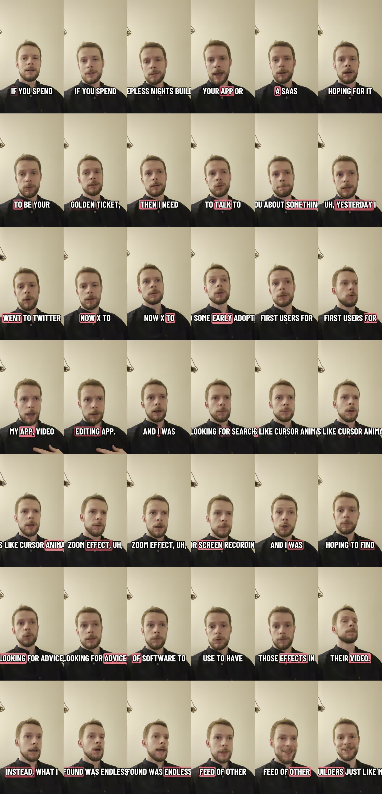

Building the product is not the hard finish line. It is the start of the next problem.

If you are building an app or SaaS and quietly believing that users will appear after launch, you are probably setting yourself up for a painful surprise. The market is full of other builders doing the same thing, talking to the same audience, using the same platforms, and searching for the same early adopters.

This post is adapted from [a YouTube video about finding users for a SaaS](https://www.youtube.com/watch?v=tjakK9Nj4bA). The video came from a real attempt to find early users for Mont, my browser-based video editor.



## The Trap

The trap is simple:

```text
I will build the product first.
Then I will launch.
Then users will find it.
```

Sometimes that happens. Usually it does not.

When I went looking for early users for a video editing app, I searched for people talking about the problems Mont could solve: screen recordings, cursor animations, zoom effects, app demos, and SaaS videos.

The hope was to find people asking for recommendations.

What showed up instead was a wall of other builders promoting their own tools.

That is the real shape of the problem. You are not only competing with existing products. You are also competing with every other founder trying to reach the same early audience.

## The Second Phase Problem

There is a phase of building where progress feels very concrete.

You add features. You fix bugs. You polish the UI. You record a demo. You ship another version. Every day produces something visible.

Then you reach the second phase:

```text
How do I get people to care?
```

That problem is less comfortable because it does not behave like a backlog item. You cannot simply implement "get users" in one pull request.

User acquisition is a system of repeated attempts:

- finding where potential users already spend time,
- learning the words they use for the problem,
- testing messages,
- replying to real conversations,
- making useful content,
- improving the product from what you hear,
- repeating the loop long enough to learn something.

If you wait until after the product is built, you start that loop late.

## Start Distribution Before Launch

You do not need a perfect product to start distribution work.

You need a clear problem and a reason to talk to people who have it.

For example, if you are building a video editor for SaaS teams, do not only post:

```text
I built a video editor. Try it.
```

Start with the user problem:

```text
Recording a SaaS demo is easy.
Making it look polished without spending an afternoon in a timeline is the hard part.
```

Then look for people already discussing that problem:

- founders making product demos,
- developers recording app walkthroughs,
- educators making screen-recorded lessons,
- marketers editing launch videos,
- people asking how to add cursor zoom, captions, or callouts.

Those conversations teach you more than a cold launch page.

## Do Not Confuse Other Builders With Your Market

Builder communities are useful, but they can distort your sense of demand.

Other founders understand the struggle. They may like your posts. They may give feedback. They may even share encouragement.

That does not always mean they are your buyers.

If you are building for SaaS teams, educators, or product marketers, you need signal from those people too. Otherwise you can end up optimizing your message for people who enjoy watching the build process but do not need the product.

That is not a reason to avoid building in public. It is a reason to separate audiences:

- builders who follow the journey,
- users who feel the problem,
- buyers who can pay for the solution.

Those groups can overlap, but they are not the same group.

## A Simple User-Finding Loop

Use this loop before and after launch.

### 1. Write Down The Problem In User Language

Avoid product language at first.

Instead of:

```text
Mont is a browser-based video editor.
```

try:

```text
I need to make a product demo look polished without learning a full video editor.
```

Search for that kind of sentence.

### 2. Find Existing Conversations

Search places where the problem appears naturally:

- Google,
- YouTube comments,
- Reddit,
- X/Twitter,
- indie founder communities,
- product marketing communities,
- support forums for adjacent tools.

Look for repeated complaints, not only high-volume keywords.

### 3. Join With A Useful Answer

Do not lead with a pitch every time.

Answer the question. Explain the tradeoff. Share a quick workaround. Then mention the product only when it is actually relevant.

The goal is to become part of the problem space before asking people to care about your solution.

### 4. Turn Repeated Questions Into Content

If you answer the same question three times, write it down as a post.

That post can become:

- a blog article,
- a YouTube video,
- a demo clip,
- a documentation page,
- a comparison page,
- a landing page section.

Distribution gets easier when the content comes from real questions instead of guesses.

## Common Mistakes

The first mistake is waiting until launch to learn where users are.

The second is treating other builders as proof of customer demand.

The third is posting only product updates. Product updates are useful for people who already care. Problem-focused content is how you reach people who do not yet know you exist.

## Exercise

Before writing another feature, write five search phrases a real user might type when they have the problem your product solves.

Then search them.

For each phrase, record:

- where discussions are happening,
- whether people are asking for tools, tutorials, or advice,
- what words they use,
- what existing solutions they mention,
- whether your product would naturally fit the conversation.

That list is the beginning of a distribution plan.

## Summary

"Build it and they will come" is not a strategy.

Build the product, but start learning distribution at the same time. Look for real conversations, learn the user's language, separate builders from buyers, and turn repeated questions into useful content.

The earlier you start that loop, the less lonely launch day becomes.
