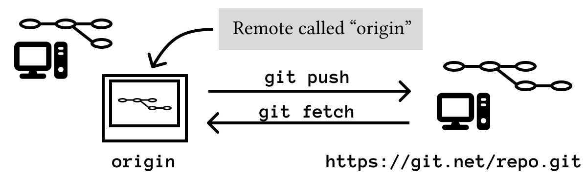

A Git remote is a named connection to another copy of the repository.

Most often, that other copy lives on GitHub, GitLab, Bitbucket, or a private server. The default remote name is usually `origin`.

You use remotes to share commits with other machines and other people.



## What Is `origin`?

`origin` is just a name.

When you clone a repository, Git usually creates a remote named `origin` pointing back to the repository you cloned from:

```bash
git clone git@github.com:example/project.git
cd project
git remote -v
```

Example output:

```bash
origin  git@github.com:example/project.git (fetch)
origin  git@github.com:example/project.git (push)
```

The same remote is listed twice because Git can use one URL for fetching and another URL for pushing. In normal projects, they are often the same.

## Add a Remote to an Existing Repository

If you created the repository locally first, add the remote yourself:

```bash
git remote add origin git@github.com:example/project.git
```

Check it:

```bash
git remote -v
```

If the URL is wrong, update it:

```bash
git remote set-url origin git@github.com:example/project.git
```

## Push Local Commits

To send local commits to a remote branch:

```bash
git push origin main
```

The first time, set the upstream relationship:

```bash
git push -u origin main
```

After that, Git knows that your local `main` branch tracks `origin/main`. Future pushes can usually be:

```bash
git push
```

Run `git status` to see whether your branch is ahead of the remote:

```bash
git status
```

If Git says your branch is ahead by one commit, you have local work that has not been pushed yet.

## Fetch Remote Changes

`git fetch` downloads remote history without changing your current files:

```bash
git fetch origin
```

After fetching, you can inspect what changed:

```bash
git log --oneline --graph --decorate --all -20
```

This is the careful option. Fetch first when you want to see what happened before integrating it.

## Pull Remote Changes

`git pull` fetches and then integrates the remote branch into your current branch:

```bash
git pull
```

If you need to be explicit:

```bash
git pull origin main
```

In beginner terms:

- `fetch`: update my knowledge of the remote.
- `pull`: update my branch with remote changes.
- `push`: send my commits to the remote.

## What Is `origin/main`?

`origin/main` is your local snapshot of the `main` branch on the `origin` remote.

It is not the remote server itself. It is Git's last fetched view of that branch.

This means `origin/main` can be stale. Run:

```bash
git fetch origin
```

to update your local view of the remote branches.

## Rename or Remove a Remote

Rename `origin` to `github`:

```bash
git remote rename origin github
```

Remove a remote:

```bash
git remote remove github
```

Removing a remote from your local repository does not delete the repository on GitHub. It only removes the saved connection from your machine.

## Common Mistakes

### Pushing to the Wrong Remote

Always check:

```bash
git remote -v
```

before pushing a repository you just cloned or inherited.

### Pulling Without Checking Local Work

Before pulling:

```bash
git status
```

If your working directory is dirty, finish, stash, or discard your local work first. Pulling with unrelated local changes can create avoidable conflicts.

### Confusing `fetch` and `pull`

If you want to inspect remote changes first, use `fetch`. If you want to immediately bring them into the current branch, use `pull`.

## Exercises

### Exercise 1: Inspect Remotes

In any cloned repository, run:

```bash
git remote
git remote -v
```

Expected result: you see the remote name and URL.

### Exercise 2: Fetch Without Merging

Run:

```bash
git fetch origin
git status
```

Expected result: Git updates remote-tracking branches without directly editing your working files.

### Exercise 3: Set Upstream on First Push

Create a local branch and push it:

```bash
git switch -c practice-branch
git push -u origin practice-branch
```

Expected result: Git creates the remote branch and connects your local branch to it.
