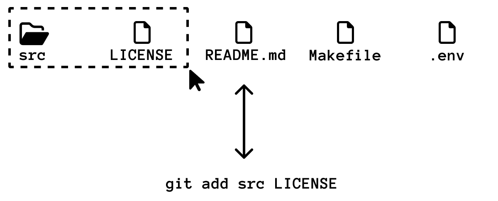
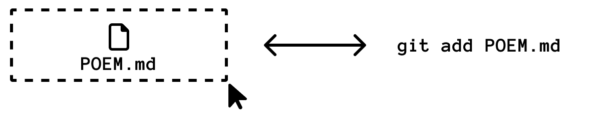

The Git staging area is the place where you prepare the next commit.

That is the short version. The more useful version is this: `git add` does not simply "save" a file. It takes the current version of a file, or part of a file, and puts that version into a proposed commit. Until you run `git commit`, you can still change your mind.

This is one of the Git ideas that feels unnecessary at first and then becomes very useful. The staging area lets you separate "what I changed" from "what I want to record right now".

## The Three Places Git Cares About

When you are editing a project, Git is usually comparing three places:

1. The last commit.
2. Your working directory.
3. The staging area.

The last commit is the saved version of the project. Your working directory is the files you are editing right now. The staging area is the draft of the next commit.

You can think of a commit as a package you are about to send. The working directory is your desk, with everything you are currently touching. The staging area is the package contents. `git add` puts things into the package. `git commit` seals it and writes the label.



That separation matters because real work is messy. You might fix a typo, add a feature, change a config file, and leave a debug line in the code before you notice that these changes should not all go into the same commit.

## A Minimal Example

Create a small repository:

```bash
mkdir staging-demo
cd staging-demo
git init
```

Now create a file:

```bash
printf "Project notes\n" > README.md
git status
```

Git will show `README.md` as an untracked file. It can see the file, but it is not part of the repository history yet.

Stage it:

```bash
git add README.md
git status
```

Now `README.md` appears under "Changes to be committed". This means Git has prepared the file for the next commit.



Commit it:

```bash
git commit -m "Add project notes"
```

After that, `git status` should say that the working tree is clean.

If the word commit still feels abstract, read [What Is a Git Commit?](/posts/what-is-a-git-commit/) next. The staging area prepares a commit; the commit records the prepared snapshot.

## Staged Does Not Mean Finished

Here is the part that often surprises beginners: staging a file does not create a permanent save point. It only updates the next commit draft.

Change the file:

```bash
printf "Remember to document setup steps.\n" >> README.md
git status
```

Git reports the file as modified. Stage it:

```bash
git add README.md
git status
```

Now edit the same file again:

```bash
printf "Temporary note: check this later.\n" >> README.md
git status
```

At this point Git can show the same file in two sections:

- `Changes to be committed`
- `Changes not staged for commit`

That looks strange until you remember what staging means. Git staged the version of `README.md` that existed when you ran `git add`. Then you changed the file again. The staged version and the working-directory version are no longer the same.

If you commit now, only the staged version goes into the commit. The later "Temporary note" line stays in your working directory.

## Check What You Are About To Commit

Before committing, get into the habit of checking the staged diff:

```bash
git diff --staged
```

This shows the exact changes that will go into the next commit.

Plain `git diff` shows unstaged changes:

```bash
git diff
```

So a useful commit routine is:

```bash
git status
git diff
git diff --staged
git commit
```

You will not run every command every time, but the distinction is important. `git diff` answers "what did I change but not stage yet?" `git diff --staged` answers "what am I about to commit?"

## Unstage Without Throwing Work Away

If you staged something by mistake, remove it from the staging area:

```bash
git restore --staged README.md
```

This does not delete your work. It keeps the file changes in your working directory and removes them from the next commit draft.

That is the command to reach for when your status output says something is ready to be committed, but you want to keep editing before it becomes part of history.

## Stage Only Some Changes

The staging area becomes much more powerful when you stage only part of a file.

Use patch mode:

```bash
git add -p README.md
```

Git will show one changed section at a time and ask what to do with it. The common answers are:

- `y`: stage this change.
- `n`: skip this change.
- `s`: split the change into smaller pieces when possible.
- `e`: edit the patch manually.
- `q`: quit patch mode.

This is useful when one file contains changes for two different commits. For a deeper walkthrough, see [Add Specific Lines With Git Patch](/posts/git-add-patch/).

## When To Use `git add .`

`git add .` stages changes under the current directory.

It is convenient, but it is also easy to stage more than you intended. Before using it, check:

```bash
git status
```

After using it, check:

```bash
git diff --staged
```

If the staged diff contains generated files, local config, or unrelated edits, unstage them before committing.

For beginner work, I prefer explicit paths:

```bash
git add README.md
git add src/app.js
```

Once you are comfortable reading `git status` and `git diff --staged`, `git add .` becomes safer because you have a verification habit.

## Exercises

### Exercise 1: Stage a New File

Create a new repository and add a `README.md` file.

Run:

```bash
git status
git add README.md
git status
git commit -m "Add readme"
```

Expected result: before `git add`, the file is untracked. After `git add`, it is listed as a change to be committed. After `git commit`, the working tree is clean.

### Exercise 2: Stage One Version, Then Edit Again

Add one line to `README.md`, stage it, then add a second line.

Run:

```bash
git status
git diff
git diff --staged
```

Expected result: `git diff --staged` shows the first line. `git diff` shows the second line.

### Exercise 3: Unstage Safely

Stage a modified file, then unstage it:

```bash
git add README.md
git restore --staged README.md
```

Expected result: the file still contains your changes, but it is no longer staged for commit.

### Exercise 4: Practice Patch Mode

Make two separate changes in the same file. For example, fix a typo near the top and add a new paragraph near the bottom.

Run:

```bash
git add -p README.md
```

Stage only one of the changes. Then check:

```bash
git diff
git diff --staged
```

Expected result: one change is staged and the other remains unstaged.

## Summary

The staging area is not extra ceremony. It is Git giving you control over the next commit.

Use `git add` to prepare changes. Use `git diff --staged` to inspect the commit draft. Use `git restore --staged` to remove changes from that draft without deleting your work. Use `git add -p` when a file contains more than one logical change.

After you understand staging and commits, use [Git Log for Beginners](/posts/git-log-for-beginners/) to inspect the history you created.

If you want a fuller beginner path through Git, I keep the book project here: [Command Line Git](/projects/command-line-git/). The book page is also available at [Command Line Git: Everything You Need to Know to Get Started](/books/command-line-git-everything-you-need-to-know-to-get-started/).
