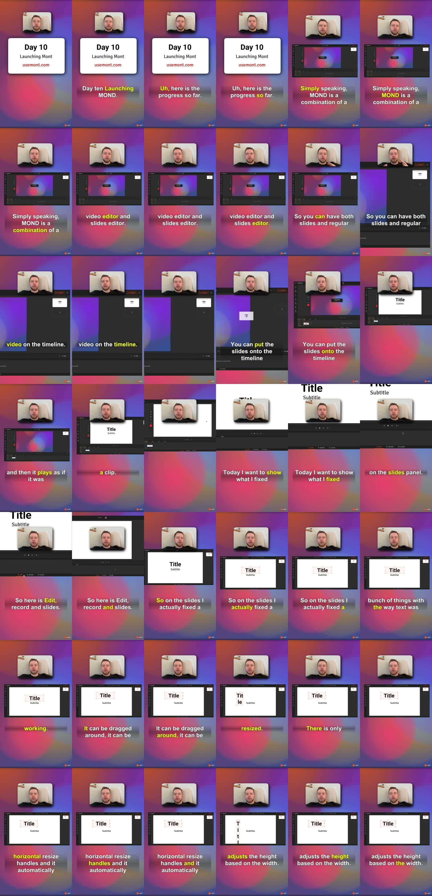

Mont is built around a simple idea: slides and video should live on the same timeline.

That makes it possible to create a product demo, tutorial, or presentation video without choosing between a slide editor and a video editor. A slide can behave like a clip, and a clip can sit beside editable slides, recordings, text, arrows, and effects.

This post is adapted from [a YouTube update about Mont's slide editing workflow](https://www.youtube.com/watch?v=D2QbCZRrBbU). For a more step-by-step tutorial, see [How To Make Your First Video In Mont](/posts/make-your-first-video-in-mont/).



## The Short Answer

Mont lets you place slides directly on a video timeline.

That means a video can contain:

- regular clips,
- editable slides,
- text,
- arrows,
- shapes,
- camera recording,
- screen recording,
- cursor and zoom effects.

Instead of exporting slides to video and editing them later, the slides stay part of the project.

## Why This Matters

Many product videos are partly presentation and partly screen recording.

You may need:

- a title slide,
- a product screenshot,
- a screen recording,
- an annotation arrow,
- a short camera explanation,
- a final call to action.

Traditional tools often make this awkward. Slide tools are good at layout but weak at timeline editing. Video editors are good at clips but make text and structured slides slower to update.

Mont tries to put those workflows together.

## Slides As Timeline Clips

In Mont, a slide can be placed on the timeline and played like a clip.

That lets you build a flow like:

```text
intro slide -> screen recording -> feature slide -> camera note -> export screen
```

The benefit is editability. If you want to change the text on a slide, you edit the slide. You do not need to render a new image, import it again, and rebuild the timing.

## Editable Text

Slide text should behave like an editable design object.

That means you can:

- drag it,
- resize it,
- type directly into it,
- let height adjust to width,
- apply text effects,
- change the visual style.

For video work, editable text matters because copy changes are common. A label, title, or callout might need to change after you watch the export.

## Effects And Annotations

Product videos often need more than text.

Useful annotation elements include:

- arrows,
- stars,
- shapes,
- shadows,
- blur,
- outline effects,
- background effects.

The point is not decoration. The point is focus. An arrow or zoom should help the viewer understand where to look.

## Anchor Points And Rotation

Objects also need predictable transforms.

An anchor point controls where rotation happens. If an object rotates around the wrong point, the motion feels strange and the layout becomes hard to control.

For a video editor that includes design elements, those small controls matter. They decide whether a timeline is pleasant to edit or constantly fighting the user.

## Why This Helps Product Demos

A product demo changes often.

The copy changes. The UI changes. The feature order changes. A sensitive detail needs to be hidden. A callout should point somewhere else.

If the demo is one flattened video, every change is expensive. If the demo is made from editable slides and timeline layers, small changes stay small.

That is the reason to combine slide editing and video editing in one place.

## Exercise

Plan a product video as a mixed timeline:

```text
Slide: title
Recording: feature walkthrough
Slide: key benefit
Recording: result
Slide: call to action
```

Then list which parts should stay editable after recording. Those are the parts that should be slides, text, arrows, or effects instead of baked into one raw video.

## Summary

Mont treats slides as part of the video timeline.

That gives product videos a more editable structure: slides for layout, video for motion, annotations for focus, and timeline editing for timing. The result is a workflow where product demos can change without starting from scratch.
