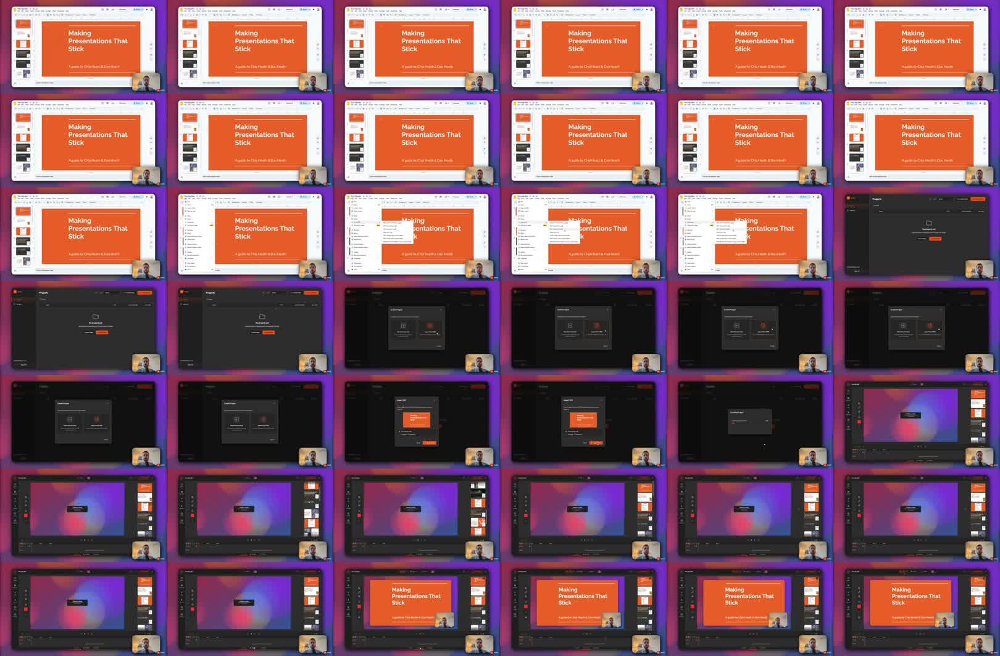

If your slides are in Google Slides, PowerPoint, Keynote, or another presentation tool, the easiest way to record a voiceover is often to export the deck as a PDF first.

Once the slides are a PDF, you can import them into a video tool, record narration while moving through the slides, adjust the camera or slide layout afterward, and export the final video.

This post is adapted from [a YouTube tutorial about recording a presentation voiceover in Mont](https://www.youtube.com/watch?v=GQ1_QaOjsWg).



## The Short Version

To record a presentation voiceover:

1. Export your slides as a PDF.
2. Create a new Mont project.
3. Import the PDF.
4. Switch to recording mode.
5. Record voiceover while moving through the slides.
6. Optionally record camera too.
7. Return to edit mode.
8. Adjust slide and camera layout.
9. Export the final video.

This works because the slide deck becomes editable video structure instead of a one-shot screen recording.

## Step 1: Export Slides As PDF

Most presentation tools can export to PDF.

In Google Slides, use:

```text
File -> Download -> PDF document
```

The exact menu changes between tools, but the idea is the same. Export the deck into a stable file that can be imported into the video project.

PDF is useful because it preserves slide layout without requiring the viewer or editor to have the original presentation app open.

## Step 2: Import The PDF Into Mont

Create a new project in Mont and choose the PDF import flow.

After import, the slides become available inside the project. You can use them as the visual structure for the video.

This is cleaner than recording the presentation window directly because you can still edit timing and layout afterward.

## Step 3: Record The Voiceover

Switch to recording mode.

You can record only the voiceover, or keep the camera enabled if the presentation benefits from a face overlay.

As you speak, move through the slides. You can click through them or use the keyboard. The goal is to record the explanation and slide changes together.

Keep the first take simple. Do not worry about perfect camera placement yet. You can adjust layout after recording.

## Step 4: Edit The Layout

After recording, switch back to edit mode.

If camera and slides are linked, unlink them so they can be edited separately. Then adjust:

- camera position,
- slide size,
- slide position,
- timing,
- dead air at the beginning or end.

This is where the video becomes more polished than a raw screen recording.

## Step 5: Export The Video

Preview the full video before exporting.

Check that:

- slides change at the right time,
- the voiceover is understandable,
- the camera does not cover important slide content,
- the final slide has enough time to be read,
- the video has a clear ending.

Then export the file.

## Common Mistakes

The first mistake is recording the presentation app directly when you know you will need edits.

The second is leaving the camera over important slide content.

The third is exporting before watching the whole video once. Timing issues are much easier to catch in playback than while recording.

## Exercise

Take a three-slide deck and export it as PDF.

Record a one-minute voiceover with camera enabled. Then unlink the camera and slides, move the camera to a better position, and export the revised version.

That exercise teaches the whole workflow without needing a long presentation.

## Summary

To record a presentation voiceover, export the slides as PDF, import them into Mont, record narration while moving through the deck, edit the layout, and export.

The PDF-based workflow keeps the presentation editable after recording, which makes it easier to polish than a raw screen capture.
