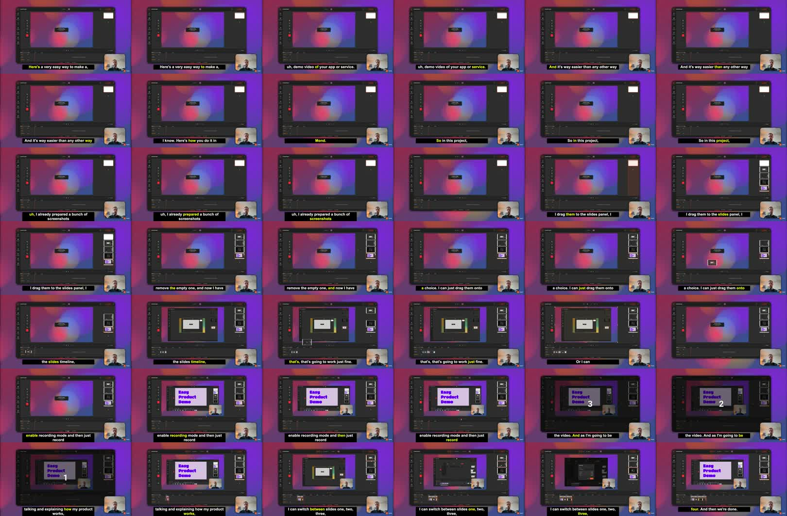

A SaaS demo video does not always need a full screen recording.

If the goal is to explain a workflow, show a polished product tour, or make a launch video quickly, screenshots can be a better starting point. You can prepare the important screens, record narration once, add cursor movement and zoom effects, then export a video that feels like a guided walkthrough.

This post is adapted from [a YouTube tutorial about making an app demo video in Mont](https://www.youtube.com/watch?v=ufdMQ142PxA). The specific tool in the video is Mont, but the workflow is useful even if you use another editor.



## The Short Version

To make a SaaS demo from screenshots:

1. Capture the key screens of the product flow.
2. Put those screenshots into a slide-based video editor.
3. Record narration while switching through the slides.
4. Add cursor movement and click indicators.
5. Add zoom effects to focus attention.
6. Generate captions.
7. Export the final video.

This gives you a demo that is easier to edit than a raw screen recording.

## Why Screenshots Can Be Better Than A Recording

A traditional screen recording captures everything:

- small mistakes,
- pauses,
- loading states,
- private data,
- mouse movement that does not matter,
- awkward timing between steps.

That can be fine for a quick internal walkthrough. It is not ideal for a polished public demo.

Screenshots give you more control. Each screen becomes a slide. If a password, customer name, or broken layout appears in one screenshot, you can replace that single image instead of recording the whole demo again.

That is the main advantage: the demo becomes editable.

## Step 1: Prepare The Product Screens

Start by deciding which path the viewer should understand.

For example:

```text
Landing page
Dashboard
Create project
Upload media
Edit timeline
Export result
```

Take one screenshot for each important step. Do not capture every tiny transition. A good demo does not need to show the entire product. It needs to show a clear path from problem to result.

Before importing the screenshots, check for:

- private data,
- test accounts,
- broken copy,
- visual clutter,
- browser tabs or notifications,
- anything that distracts from the feature.

## Step 2: Put Screenshots On A Timeline

Import the screenshots into your editor and place them in order.

At this point the video will look like a plain presentation. That is expected. The goal of this stage is only to create the structure:

```text
screen 1 -> screen 2 -> screen 3 -> screen 4
```

Once the order is right, record narration while moving through the slides. Talk as if you are walking a user through the feature.

The narration gives the video rhythm. The screenshots give it structure.

## Step 3: Add Cursor Movement

A demo needs attention cues.

If the viewer does not know where to look, they will miss the point of the screen. Cursor movement solves that. Add a cursor effect where the user would naturally click:

- the create button,
- the upload area,
- a timeline control,
- a settings menu,
- the export button.

Do not animate every possible movement. Use cursor motion to explain intent.

For example:

```text
Move cursor to "Export"
Show click
Switch to export result
```

That is enough to communicate the action.

## Step 4: Use Zoom To Focus Attention

Zoom effects make the video feel less like a static slide deck.

Use them when the important UI element is small or surrounded by other information. A zoom should answer the viewer's question:

```text
Where should I look right now?
```

Good places to zoom:

- buttons,
- form fields,
- selected objects,
- timeline controls,
- before/after results.

Avoid zooming just because the tool allows it. Too many zooms make the video feel nervous.

## Step 5: Keep The Demo Editable

The biggest benefit of this workflow is what happens after recording.

If one screen changes, update one screenshot. If one step becomes irrelevant, remove one slide. If you need to hide private information, edit the image and keep the rest of the video.

With a normal screen recording, a small correction often means recording again.

With a screenshot-based demo, the structure stays intact.

## Step 6: Add Captions

Captions make the demo usable without sound and easier to skim.

After recording narration, generate subtitles and style them so they are readable over the product UI. Keep the style simple:

- high contrast,
- enough padding,
- no tiny text,
- no captions covering the button or area being demonstrated.

Captions are especially useful for social clips, landing pages, and documentation pages where the viewer may not have audio enabled.

## A Practical Demo Checklist

Before exporting, check:

- Does the first screen explain what the demo is about?
- Is every screenshot necessary?
- Does the cursor show the important action?
- Do zooms focus attention instead of distracting?
- Are captions readable on mobile?
- Is private data removed?
- Can someone understand the result without watching twice?

If the answer is no, fix the structure before adding more effects.

## Exercise

Pick one feature in your app and make a six-screen demo:

1. Problem or starting point.
2. First action.
3. Main configuration.
4. Result preview.
5. Export or save action.
6. Final outcome.

Then record a one-minute narration over those screens. Add only two cursor clicks and one zoom. That constraint forces you to choose the important moments.
