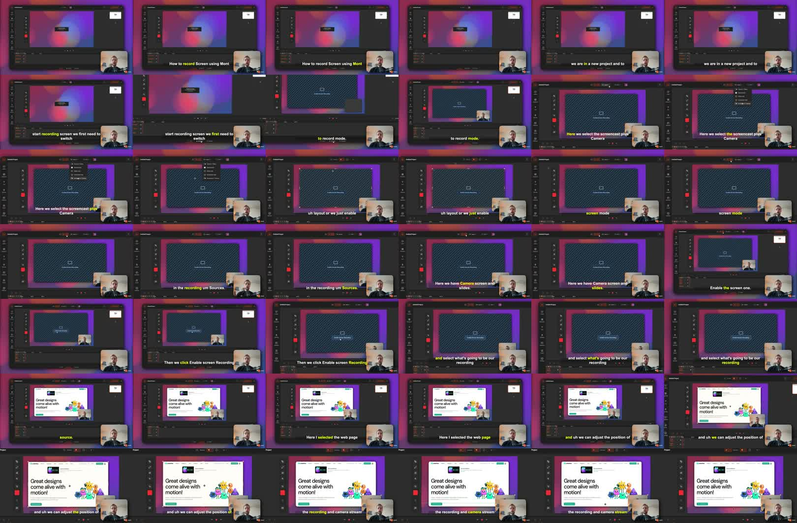

Mont can record your screen and camera into separate timeline layers.

That matters because a screen recording is rarely perfect on the first take. If the camera and screen are separate layers, you can reposition them, crop them, apply zoom effects, and edit the result before exporting.

This post is adapted from [a YouTube tutorial about recording your screen in Mont](https://www.youtube.com/watch?v=EKGyk1Q0Dbo). For a broader demo workflow, see [How To Record A SaaS Demo Video From Screenshots](/posts/record-saas-demo-video-from-screenshots/).



## The Short Version

To record your screen in Mont:

1. Open or create a project.
2. Switch to recording mode.
3. Enable the screen source.
4. Optionally enable camera.
5. Choose the window, tab, or screen to record.
6. Press record.
7. Stop recording and return to edit mode.
8. Adjust the screen and camera layers.
9. Add zoom effects if needed.
10. Export the file.

Recording is not the final step. Editing after recording is where the video becomes useful.

## Step 1: Switch To Recording Mode

Start in a Mont project and switch to recording mode.

You can choose a layout that includes screencast and camera, or manually enable the sources you want:

```text
camera
screen
slides
```

For a screen recording, enable the screen source. Keep camera enabled if the video benefits from a face overlay.

## Step 2: Choose The Recording Source

After enabling screen recording, choose what Mont should capture.

That might be:

- a browser tab,
- an app window,
- the entire screen.

For most product demos, a single browser tab or app window is cleaner than recording the whole desktop. It reduces distractions and avoids exposing notifications, other tabs, or private files.

## Step 3: Position The Screen And Camera

Before recording, check the layout.

If you are recording both screen and camera, decide where the camera should appear. Keep it away from the UI controls the viewer needs to see.

Good camera positions usually avoid:

- primary buttons,
- navigation,
- code or text being explained,
- captions,
- forms.

If the camera covers important information, move it before recording or plan to adjust it afterward.

## Step 4: Record The Walkthrough

Press record and walk through the flow.

Keep the recording focused. A useful screen recording usually has one job:

```text
show one feature
explain one workflow
answer one question
```

If you try to cover the whole product, the video becomes harder to edit and harder to watch.

## Step 5: Edit The Recording Layers

After you stop recording, go back to edit mode.

Mont places the recording streams on the timeline. If screen and camera were recorded separately, you can edit them separately.

That means you can:

- move the camera,
- crop the screen recording,
- resize either layer,
- adjust timing,
- remove dead air,
- add effects without flattening the recording.

This is the main advantage over a plain recording file.

## Step 6: Add A Zoom Effect

Use zoom when the viewer needs to focus on a specific part of the screen.

For example, if the action happens in the corner of the UI, a zoom effect can make it obvious. In Mont, the zoom effect applies to layers below it by default, so layer order matters. Keep the camera above the zoom effect if you do not want the camera to be zoomed.

Use zoom sparingly. Too much movement makes a tutorial harder to follow.

## Step 7: Preview And Export

Before exporting, preview the recording from the beginning.

Check:

- Is the screen readable?
- Is the camera blocking anything important?
- Does the zoom happen at the right time?
- Is there dead air at the start or end?
- Does the video answer the question in the title?

Then export the file.

## Exercise

Record a one-minute screen walkthrough with camera enabled.

After recording, make three edits:

1. Move the camera to a less distracting corner.
2. Crop or resize the screen recording.
3. Add one zoom effect to the most important action.

Export the result and compare it to the raw recording.
