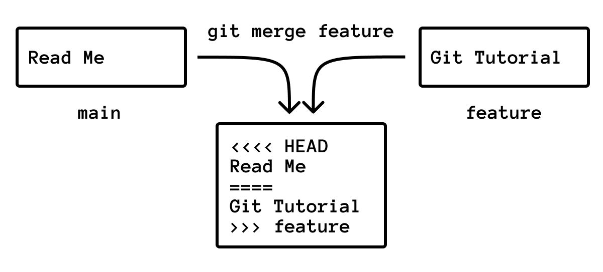

A Git merge conflict happens when Git cannot safely combine two changes by itself.

Most merges are automatic. Conflicts happen when two branches change the same part of the same file, or when one branch changes a file in a way that contradicts another branch.

The fix is not magic. You inspect the file, decide what the final content should be, remove the conflict markers, stage the file, and finish the merge.



## The Conflict Workflow

When a merge produces conflicts, use this sequence:

```bash
git status
```

Open each conflicted file. Fix the content. Then:

```bash
git add <file>
git commit
```

If Git already prepared a merge message, you can use:

```bash
git commit --no-edit
```

## What Conflict Markers Mean

A conflicted file may look like this:

```text
<<<<<<< HEAD
# Read Me
=======
# Git Tutorial
>>>>>>> feature/readme-title
```

The markers split the competing versions:

- `<<<<<<< HEAD`: starts the current branch version.
- `=======`: separates the two versions.
- `>>>>>>> feature/readme-title`: ends the incoming branch version.

`HEAD` means the branch you had checked out when you started the merge. The name at the bottom is the branch being merged in.

## Resolve It Manually

Choose the final content. You can keep the current version:

```text
# Read Me
```

You can keep the incoming version:

```text
# Git Tutorial
```

Or you can combine them:

```text
# Git Tutorial

A short README for the project.
```

The important part: remove all conflict markers. A resolved file should not contain `<<<<<<<`, `=======`, or `>>>>>>>`.

Then stage it:

```bash
git add README.md
git status
```

When all conflicts are staged, finish the merge:

```bash
git commit --no-edit
```

## Use Ours or Theirs for One File

Sometimes you know you want one side .

Keep the current branch version:

```bash
git checkout --ours README.md
git add README.md
```

Keep the incoming branch version:

```bash
git checkout --theirs README.md
git add README.md
```

This is useful for generated files, lockfiles, or files where one side is clearly correct. For source code and documentation, read the conflict first.

## Abort and Start Over

If the merge is going badly and you want to return to the state before the merge:

```bash
git merge --abort
```

This is the right move when you realize you started from the wrong branch or need to update your branch first.

## How To Avoid Conflicts

You cannot avoid every conflict, but you can reduce them:

- Keep branches small and short-lived.
- Pull or fetch regularly.
- Avoid mixing formatting-only changes with feature changes.
- Split unrelated changes into separate commits.
- Coordinate before editing the same large file.

Small commits help. If you are still building that habit, read [What Is a Git Commit?](/posts/what-is-a-git-commit/).

## Practice Scenario

Create a small repository:

```bash
mkdir conflict-demo
cd conflict-demo
git init
git branch -M main
printf "# Project\n" > README.md
git add README.md
git commit -m "Add readme"
```

Create a branch and change the title:

```bash
git switch -c feature-title
printf "# Git Tutorial\n" > README.md
git commit -am "Change title for tutorial"
```

Return to `main` and make a competing change:

```bash
git switch main
printf "# Read Me\n" > README.md
git commit -am "Change title for readme"
```

Now merge:

```bash
git merge feature-title
```

Git should report a conflict in `README.md`. Open the file, choose the final title, remove the markers, then run:

```bash
git add README.md
git commit --no-edit
```

## Common Mistakes

### Committing Conflict Markers

Before committing, search the file:

```bash
grep -n "<<<<<<<\\|=======\\|>>>>>>>" README.md
```

If this prints anything, the conflict is not fully resolved.

### Resolving Without Running Tests

The file can look clean but still be logically wrong. After resolving conflicts, run the relevant tests or build command before pushing.

### Not Checking Status

Use `git status` after every step. It tells you which files still need resolution and when the merge is ready to commit.
