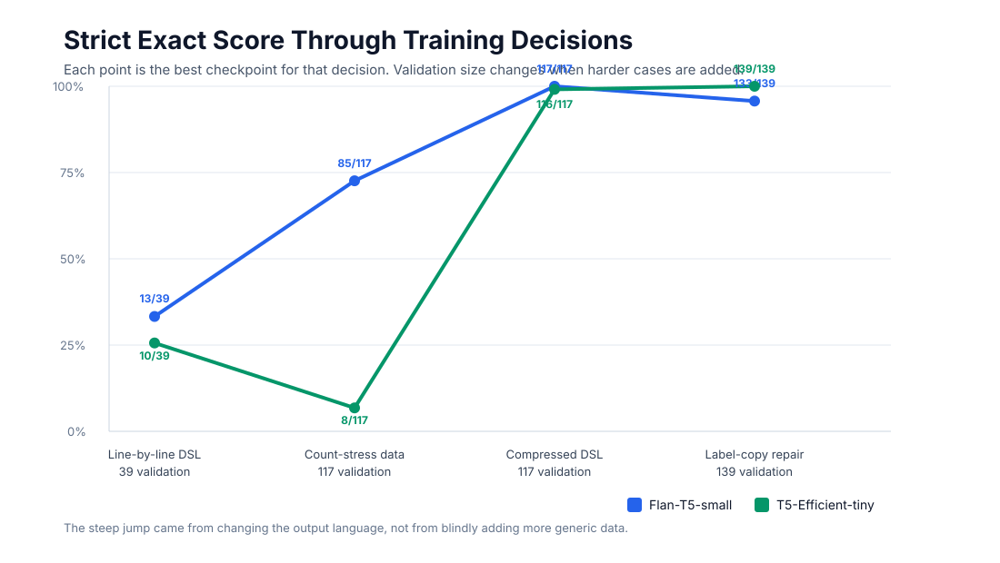
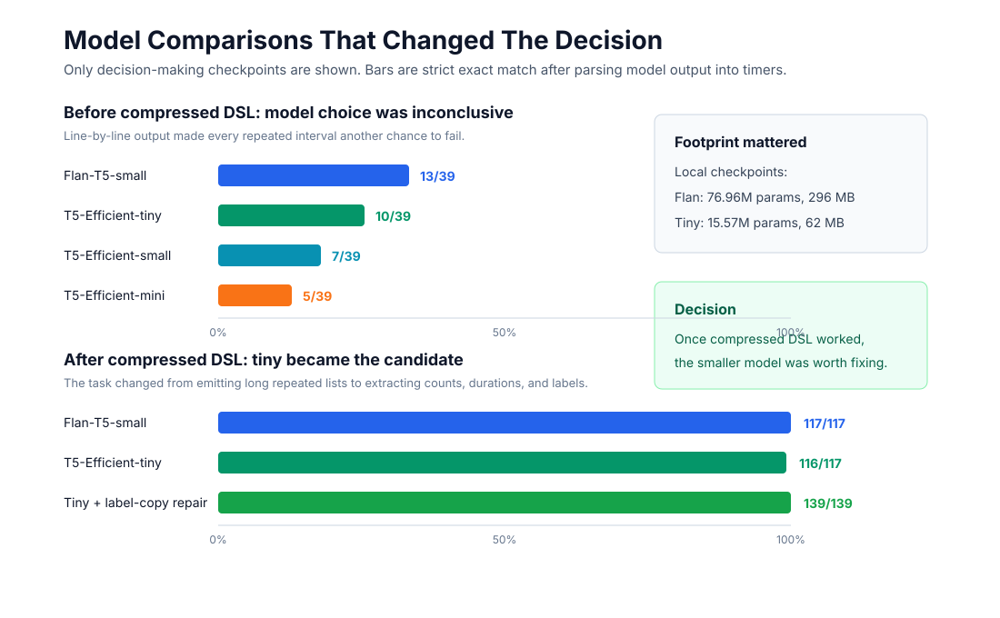

Natural-language timers look like a small problem until you require exact output.

I wanted to see whether a small browser-friendly model could translate workout instructions into exact timer sequences. The interesting part was not only which model won, but how much the output format changed the result.

This request is easy for a person:

```text
8 minute warmup, 8 minute cooldown and six steps in the middle
one minute each alternating between work and rest
```

But the app cannot accept "approximately right." It needs a timer sequence with the right count, order, labels, kinds, and durations.

The goal of this training session was to see whether a small browser-friendly model could translate user requests into timer plans. We started from a Qwen/Gemma-style chat model question, but the result was more interesting: the biggest gains came from changing the output language, not from choosing a larger model.

## The Short Answer

Do not train a tiny model to emit JSON for this task.

Train it to emit a compact timer DSL, parse that DSL deterministically, and score the expanded timer array.

The final model target looked like this:

```text
8m: Warmup
6alt 1m: Work | 1m: Rest
8m: Cooldown
END
```

That expands to the same internal timer objects the app already needs:

```json
[
  { "label": "Warmup", "durationSeconds": 480, "kind": "warmup" },
  { "label": "Work", "durationSeconds": 60, "kind": "work" },
  { "label": "Rest", "durationSeconds": 60, "kind": "rest" },
  { "label": "Work", "durationSeconds": 60, "kind": "work" },
  { "label": "Rest", "durationSeconds": 60, "kind": "rest" },
  { "label": "Work", "durationSeconds": 60, "kind": "work" },
  { "label": "Rest", "durationSeconds": 60, "kind": "rest" },
  { "label": "Cooldown", "durationSeconds": 480, "kind": "cooldown" }
]
```

The model only learns the fuzzy part: map natural language to a compact command.

The parser owns the exact part: expand repeats, normalize durations, infer timer kinds, and reject malformed output.

## The Metric

The useful metric was strict exact match after parsing:

- same number of timers,
- same duration for every timer,
- same kind for every timer,
- same label for every timer.

I also tracked semantic exact match, which ignores labels. That was useful for debugging, but strict exact match was the gate. A timer model that gets the intervals right but drops `Plank` and `Squats` is still wrong for the user.

## What Changed The Curve

The first attempt was conventional: prepare natural-language requests and train the model to emit strict JSON.

That was the wrong target. Earlier in the session, Qwen2.5 0.5B moved from `0/40` to only `5/40` after 300 LoRA iterations on JSON output. That `5/40` score did not mean Qwen was bad. The target was making a small model spend capacity on braces, quotes, arrays, and property names.

Switching to a DSL helped, but not enough at first.

Line-by-line DSL targets like this still required the model to enumerate every repeated timer:

```text
8m: Warmup
1m: Work
1m: Rest
1m: Work
1m: Rest
1m: Work
1m: Rest
8m: Cooldown
END
```

The models learned the syntax quickly. They became parseable. But they still made count errors: stop one interval early, jump to cooldown, or add an extra repeated block.

The decisive change was compressed repeat syntax:

```text
6alt 1m: Work | 1m: Rest
```

That command means "emit six total timers by alternating these two atoms."

For repeated rounds:

```text
4x 1m: Rest | 1m: Work
```

That means four full rest/work rounds, or eight timers total.

For generic repeated timers:

```text
20x 10s: Timer
```

The parser expands and numbers them internally.



The validation set changed as the dataset got harder, so this is not one continuous scientific benchmark. It is a decision log. Each point represents the best checkpoint after a training or data-format change.

The Flan-T5-small line dips on the final point because the same compressed checkpoint was rescored on the new harder label-copy validation set. I did not tune Flan further there because tiny had become the better browser candidate.

The shape matters:

- More count examples alone helped Flan-T5-small, but hurt tiny.
- Compressed DSL fixed the long-output problem for both models.
- The final tiny gap was not counting anymore. It was label copying.

## The Model Comparison

Early model comparison was useful, but only after the target was made reasonable.

With line-by-line DSL, `google/flan-t5-small` was the best local candidate, but the best score was only `13/39`. The efficient-family models were smaller, but still weak. Tiny reached `10/39` in the early setup. That was not enough to ship.

After compressed DSL, the comparison changed completely. The chart that mattered was not accuracy alone; it was accuracy against model footprint.



Flan-T5-small hit `117/117` on the compressed validation set. `google/t5-efficient-tiny` hit `116/117`.

That changed the decision.

Locally, the Flan checkpoint was about `76.96M` parameters and `296 MB`. The tiny checkpoint was about `15.57M` parameters and `62 MB`.

Tiny was one validation row worse, but roughly `4.8x` smaller on disk. Fixing the one tiny failure mode made more sense than switching to the larger perfect model.

## The Last Failure

The remaining tiny failure was explicit label copying.

The model handled compressed count syntax, but when the input looked like:

```text
30 seconds plank, 45 seconds squats, 1 minute rest
```

it sometimes produced a generic timer command instead of preserving labels:

```text
30s: Timer
END
```

That made sense after looking at the dataset. The original explicit-sequence category had only five examples. Tiny had learned the dominant compressed workout patterns, but it had not learned that arbitrary exercise names should be copied.

The fix was targeted:

- add explicit label-copy examples,
- keep validation fixed,
- add train-only hint rows for the stubborn residual patterns,
- oversample `explicit-label-copy` and `explicit-sequence`,
- continue from the existing tiny checkpoint at a lower learning rate.

The final dataset had `685` train rows and `139` validation rows. The label-copy slice added `98` train examples and `22` validation examples, plus train-only hints.

The final tiny checkpoint reached:

- `139/139` strict exact on the augmented validation set,
- `139/139` semantic exact,
- `39/39` strict exact on the original validation set,
- `22/22` on the explicit label-copy validation category.

The fix was targeted: add the data that represents the skill the model is missing, and weight it enough that a tiny model cannot ignore it.

## The Parser Became The Product Boundary

One important engineering change came out of the training work: the DSL parser could not stay as a training-only helper.

If the model is trained to emit:

```text
5alt 45s: Rest | 45s: Work
```

then the app must understand exactly that grammar.

So the parser became a shared module used by:

- human timer shorthand input,
- fallback planning,
- dataset generation,
- dataset validation,
- JavaScript evaluation,
- Python seq2seq benchmark scoring.

The Python benchmark now batch-calls the shared JavaScript parser instead of keeping a separate parser copy. That matters because training numbers are meaningless if evaluation accepts syntax the app cannot execute.

## What I Would Keep

I would keep this structure for any narrow natural-language-to-action model:

1. Choose a compact output language.
2. Make the output language deterministic to parse.
3. Train the model to emit that language, not the final application JSON.
4. Evaluate by executing/parsing the output and comparing real semantics.
5. Add data by failure category, not by vague volume.
6. Compare models only after the target is fair.

For this timer app, the compressed DSL was the actual breakthrough. Model size mattered after that, but before that the models were mostly being punished for an output format that made counting harder than it needed to be.
