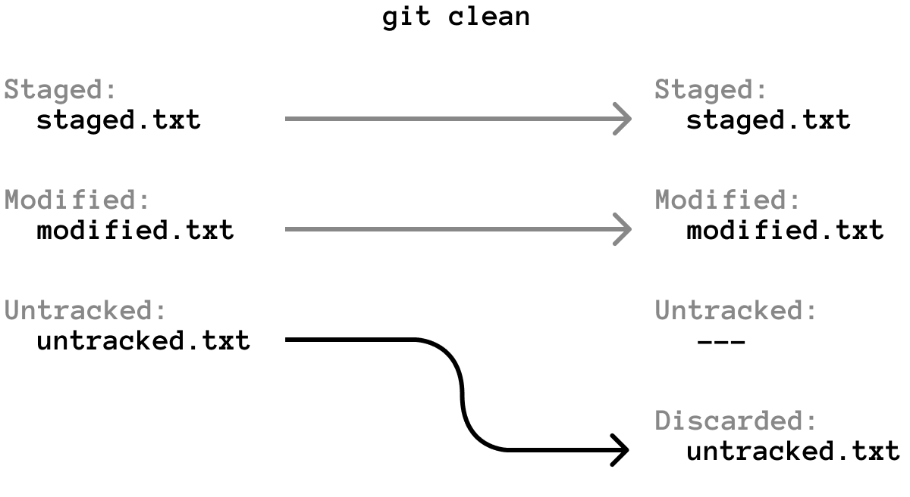
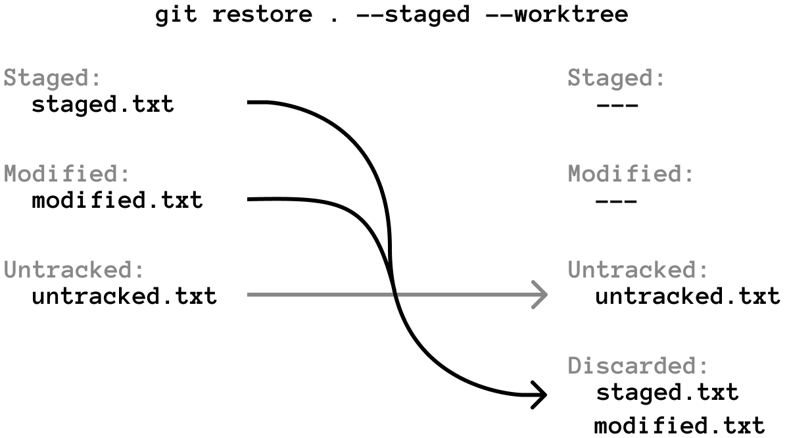
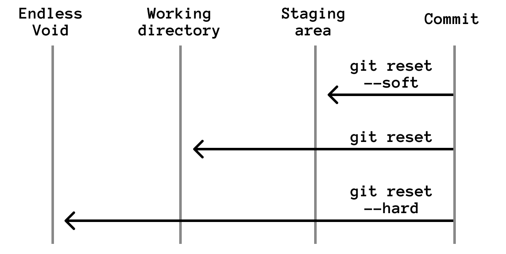

Undoing changes in Git depends on where the change lives.

Before choosing a command, answer one question: is the change uncommitted, committed locally, or already pushed?

That distinction matters because some commands only change your working directory, while others change commit history.

## Short Answer

Use this as the beginner decision table:

- Unstaged tracked file: `git restore <file>`
- Staged file you want to unstage: `git restore --staged <file>`
- Staged and unstaged file you want to discard: `git restore --staged --worktree <file>`
- Untracked files you want to delete: `git clean -n`, then `git clean -f`
- Bad commit already pushed: `git revert <commit>`
- Bad local commit not pushed yet: `git reset --soft HEAD~1` or `git reset HEAD~1`
- Bad local commit and you want to throw it away: `git reset --hard HEAD~1`

Run `git status` first. It tells you which bucket you are in.

## Safe First Step

Before undoing anything, inspect the repository:

```bash
git status
git diff
git diff --staged
```

`git status` shows whether files are staged, unstaged, or untracked. `git diff` shows unstaged changes. `git diff --staged` shows what is already prepared for the next commit.

If you are still getting comfortable with this distinction, start with [Git Staging Area Explained](/posts/git-staging-area-explained/).

## Remove Untracked Files

Untracked files are files Git sees but does not track yet. They might be generated build output, temporary notes, or new files you created by mistake.

Preview first:

```bash
git clean -n
```

If the preview is correct, remove them:

```bash
git clean -f
```



Do not skip the preview when you are learning. `git clean -f` deletes files; it does not move them to the trash.

## Discard Changes in a Tracked File

If a tracked file has unstaged changes and you want to go back to the last committed version:

```bash
git restore README.md
```

For every tracked file in the current directory:

```bash
git restore .
```

This discards working-directory changes. It does not affect commits.

## Unstage a File Without Deleting the Work

If you staged a file but want to keep editing before committing:

```bash
git restore --staged README.md
```

This removes the file from the [staging area](/posts/git-staging-area-explained/) but keeps the changes in your working directory.

## Discard Both Staged and Unstaged Changes

If you want a tracked file to match the last commit again, including staged changes:

```bash
git restore --staged --worktree README.md
```

For all tracked files:

```bash
git restore --staged --worktree .
```



This is useful when the current working directory is not worth saving and you want to return tracked files to a clean state.

## Undo a Commit That Was Already Pushed

If the commit is already pushed, prefer `git revert`.

```bash
git revert <commit-id>
```

`git revert` creates a new commit with the opposite change. The original commit stays in history, and the new commit undoes its effect.

That is why `revert` is the safe collaboration command. It does not rewrite shared history.

Example:

```bash
git log --oneline
git revert a8c92f1
git push
```

Use [Git Log for Beginners](/posts/git-log-for-beginners/) if you need help finding the commit ID.

## Undo a Local Commit With Reset

If the commit is local and has not been pushed, `git reset` is often useful.

There are three common modes:



Move the last commit back into the staging area:

```bash
git reset --soft HEAD~1
```

Move the last commit back into the working directory:

```bash
git reset HEAD~1
```

Throw away the last commit and its changes:

```bash
git reset --hard HEAD~1
```

Be careful with `--hard`. It discards work. If you are not certain, use `--soft` or the default reset first.

## Practical Recipes

### I staged the wrong file

```bash
git restore --staged wrong-file.txt
```

### I changed a tracked file and want to discard the edit

```bash
git restore wrong-file.txt
```

### I created generated files and want to remove them

```bash
git clean -n
git clean -f
```

### I committed too early but did not push

```bash
git reset --soft HEAD~1
```

Edit, stage, and commit again.

### I pushed a bad commit

```bash
git revert <commit-id>
git push
```

## Exercises

### Exercise 1: Unstage Safely

Modify a file, stage it, then unstage it:

```bash
git add README.md
git restore --staged README.md
git status
```

Expected result: the file is modified but not staged.

### Exercise 2: Preview Untracked Cleanup

Create a temporary file:

```bash
printf "temporary\n" > scratch.txt
git clean -n
```

Expected result: Git tells you it would remove `scratch.txt`.

### Exercise 3: Undo a Local Commit

Create a small commit, then run:

```bash
git reset --soft HEAD~1
git status
```

Expected result: the commit is gone from history, but its changes are staged.
