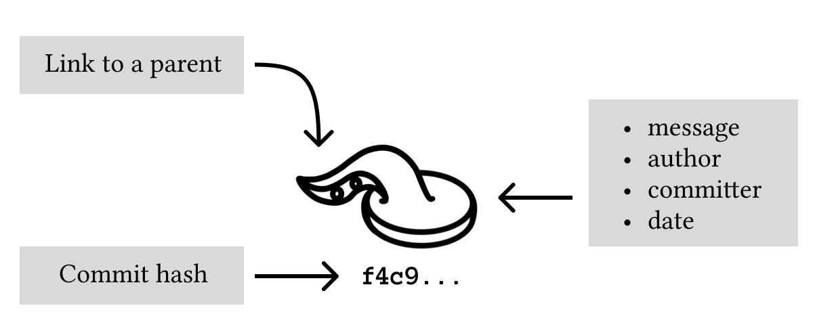
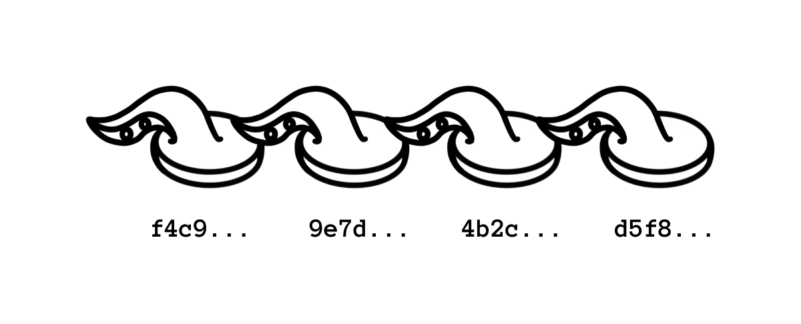
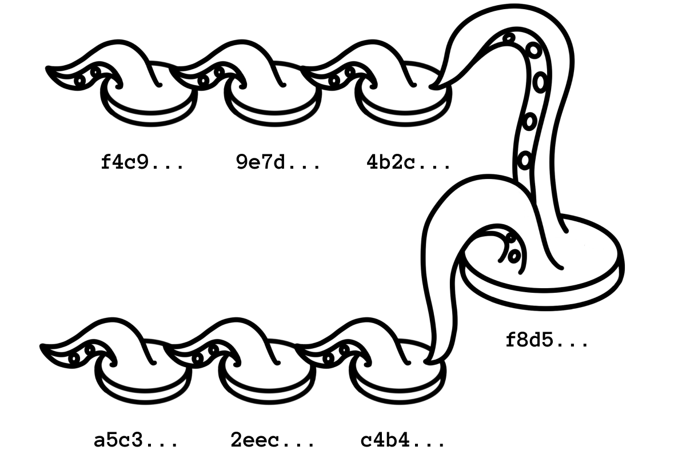

A Git commit is a saved snapshot of your project.

That is the simplest useful definition. When you run `git commit`, Git takes the changes you prepared in the [staging area](/posts/git-staging-area-explained/) and records them as a new point in the project history.

You can come back to that point later, compare it with another point, share it with other developers, or use it to understand why the project changed.

## What a Commit Contains

A commit is more than the changed lines of code. It stores enough information for Git to place that snapshot in history.

A commit contains:

- The project snapshot.
- A unique commit ID.
- The parent commit ID.
- The author.
- The committer.
- A timestamp.
- A commit message.

The project snapshot is the important part for your work. The parent commit is the important part for history. It lets Git connect commits into a chain.



Imagine a notebook where every page is a saved version of your project. Each page says which page came before it. That is enough to walk backward through the story of the project.

## Commits Form a Chain

Start with an empty repository:

```bash
mkdir commit-demo
cd commit-demo
git init
```

Create and commit a file:

```bash
printf "Project checklist\n" > README.md
git add README.md
git commit -m "Add checklist"
```

Now add another change:

```bash
printf "- Write installation notes\n" >> README.md
git add README.md
git commit -m "Add installation task"
```

Inspect the history:

```bash
git log --oneline
```

You will see the newest commit first:

```bash
4f2a7c1 Add installation task
91d3b62 Add checklist
```

The exact IDs will be different in your repository. What matters is the order. The second commit points back to the first commit. That link is how Git knows the history.



## Why Commit IDs Change

The commit ID is calculated from the commit contents and metadata. That includes the parent commit, the author information, the timestamp, and the message.

This is why changing a commit creates a different ID. Even if the code looks almost identical, Git treats the changed commit as a new object.

That detail matters when you use commands such as:

```bash
git commit --amend
git rebase
```

These commands rewrite commits. Rewriting local commits is normal. Rewriting commits that other people already pulled can create confusion.

Beginner rule: amend freely before pushing, be careful after pushing.

## How To Create a Good Commit

A good commit has one coherent purpose.

These are good commit boundaries:

- Add a missing validation check.
- Fix a typo in documentation.
- Rename a component and update imports.
- Add one test for one behavior.

These are poor commit boundaries:

- Fix login, rewrite styles, and update dependencies.
- Add a feature and include unrelated formatting changes.
- Commit temporary debug output.

Git does not force you to make clean commits. It gives you tools to do it. The most important one is the staging area.

Use:

```bash
git status
git diff
git add <file>
git diff --staged
git commit -m "Describe the change"
```

`git diff --staged` is the last check before you record history. It shows exactly what the commit will contain.

## Writing the Commit Message

The first line should say what changed.

Prefer messages like:

```bash
git commit -m "Add setup instructions"
git commit -m "Fix empty search results state"
git commit -m "Rename user profile route"
```

Avoid messages like:

```bash
git commit -m "changes"
git commit -m "fix"
git commit -m "stuff"
```

The commit message is not only for other people. It is also for future you, searching through history to understand why something happened.

If a change needs context, use a longer message:

```bash
git commit \
  -m "Fix empty search results state" \
  -m "The header search dropdown rendered an empty panel when Pagefind returned no matches. Show a short message instead."
```

The first `-m` is the subject. The second `-m` becomes the body.

## What Is a Merge Commit?

Most commits have one parent. A merge commit has more than one parent.

That happens when Git combines two lines of work:

```bash
git merge feature/search
```

The merge commit says: this new point in history comes from both the current branch and the branch that was merged.



You do not need to master merge commits on day one. Just know that when `git log --graph` shows two lines joining together, the commit where they join is a merge commit.

## Amending the Last Commit

If you forgot to include a small change in the last commit, stage it and amend:

```bash
git add README.md
git commit --amend --no-edit
```

This keeps the old commit message and replaces the last commit with a new one that includes the staged change.

If the message itself was wrong:

```bash
git commit --amend -m "Add setup instructions"
```

Use this while the commit is still local. If you already pushed it and other people may have based work on it, prefer creating a new commit instead.

## Exercises

### Exercise 1: Make Two Commits

Create a repository with a `README.md` file. Commit the first version. Add another line and commit again.

Run:

```bash
git log --oneline
```

Expected result: you see two commits, newest first.

### Exercise 2: Inspect a Commit

Copy the ID of the older commit and run:

```bash
git show <commit-id>
```

Expected result: Git shows the commit metadata and the diff introduced by that commit.

### Exercise 3: Amend Before Pushing

Create a commit, then make one more small edit.

Run:

```bash
git add README.md
git commit --amend --no-edit
git log --oneline
```

Expected result: you still have one commit for that change, but the commit ID changed.
