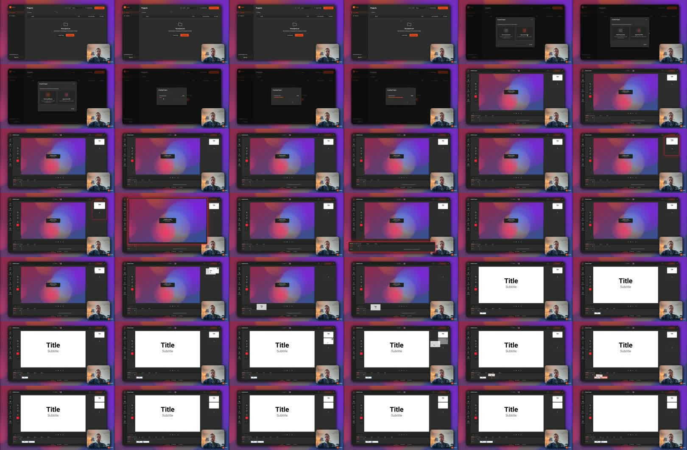

[Watch the source video](https://www.youtube.com/watch?v=Cw_JrTcRtpg)

Draft source: Youtube, 133 sec, published 2026-03-14.

## Direct Answer

Here is how you create your first video in Mont, from the dashboard we click Create Project, and for now we choose Start from scratch.

TODO: Rewrite this section so it answers the search intent directly. Do not publish the raw transcript.

## Why This Matters

TODO: Explain the problem the viewer had in the video and turn it into a durable article premise.

## Step 1

TODO: Convert the first practical beat from the transcript into a clear step.

## Step 2

TODO: Add an example, command, code snippet, checklist, or before/after comparison.

## Common Mistakes

- TODO: Add mistake 1.
- TODO: Add mistake 2.
- TODO: Add mistake 3.

## Exercise

TODO: Add one small action the reader can take immediately.

## Summary

TODO: Recap the article and link to one or two related posts.

<!--
Conversion notes:
- Slug suggestion: how-to-make-your-first-video-in-mont
- Source transcript follows for editing context only. Remove before publishing.

Here is how you create your first video in Mont, from the dashboard we click Create Project, and for now we choose Start from scratch. Let's use as video clips. Let's create a new slide and add right after the first one. This way we can play around with the flow of the presentation and make sure that it feels nice. Once we are ready, we can record the voice over and camera. To do it, press Record, and then here we are going to be recording only the camera. So we will disable the slides screen source, and you can see on the scene we now see the recorded label over the existing slides that are already on the timeline. Let's put the playhead to the beginning, press Record, and then stop. Back to edit mode, here we can adjust the spans a little bit, and we can preview the recording. If you want, you can adjust the content of the slides by double clicking them. It will make a transition to slides mode, and then here you can edit the text. Let's say great, go back to edit mode, and then here the slide is updated. We can also update the slide size, position, let's try centering it, and we can also make it a little bit more rounded. It will look nicer. Let's move the camera, and I'm ready to download the video. To do it, press the download button, and then press Expert, save, and the video is complete, and now you have your first video made in mod.
-->
