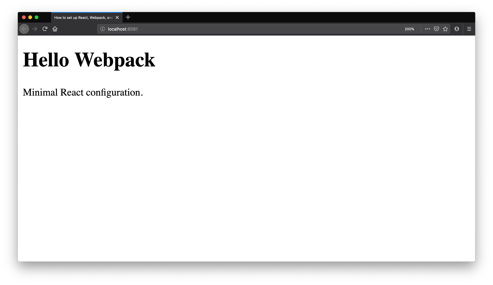

<div class="glitch-embed-wrap" style="height: 420px; width: 100%;">
  <iframe
    allow="geolocation; microphone; camera; midi; vr; encrypted-media"
    src="https://glitch.com/embed/#!/embed/zdog-webpack-logo?path=index.html&previewSize=100&attributionHidden=true"
    alt="zdog-webpack-logo on Glitch"
    style="height: 100%; width: 100%; border: 0;">
  </iframe>
</div>

Usually `create-react-app` is enough to create new React applications, and if you need to have some specific settings - you can always `eject` and alter it's webpack configuration. But sometimes you just need to set up project from scratch.

In this tutorial you will learn how to setup Webpack with Babel and React support. We'll also configure a dev server.

## Step 1: Initialize Project

- Create new folder `webpack-react` and open it:

  ```sh
  mkdir webpack-react && cd $_
  ```

  `$_` is a reference to the last argument to the previous command.

- Initialize a new npm project:

  ```sh
  npm init -y
  ```

  This command will create `package.json` file in your directory. We pass the `y` option to skip the questions.

- Create file `src/index.html` with following contents:

  ```html
  <!DOCTYPE html>
  <html lang="en">
    <head>
      <meta charset="utf-8" />
      <title>How to set up React, Webpack, and Babel</title>
    </head>
    <body>
      <div id="root">
        <!-- Mounting point for your application -->
      </div>
    </body>
  </html>
  ```

## Step 2: Set Up Webpack

- Install `webpack`, `webpack-cli`, `webpack-dev-server`, `html-webpack-plugin` and `html-loader` as dev dependencies:

  ```sh
  npm i webpack webpack-dev-server html-webpack-plugin --save-dev
  ```

  Here's why they are needed:

  * `webpack` is core dependency
  * `webpack-dev-server` will allow us to run dev server
  * `html-webpack-plugin` simplifies working with `html` files

- Create `webpack.config.js` with following content:

  ```js
  const HtmlWebPackPlugin = require("html-webpack-plugin");
  const path = require('path');

  module.exports = {
    entry: "./src/App.js",
    output: {
      path: path.resolve(__dirname, 'dist'),
      filename: 'bundle.js',
    },
    plugins: [new HtmlWebPackPlugin({ template: "./src/index.html" })]
  };
  ```

- Add `build` and `start` commands to `scripts` section of `package.json`:

  ```json
  "scripts": {
    "build": "webpack --mode production",
    "start": "webpack-dev-server --open --mode development",
  }
  ```

## Step 3: Set Up Babel

- Install Babel dependencies:

  ```sh
  npm i @babel/core babel-loader @babel/preset-env @babel/preset-react --save-dev
  ```

  We've installed babel and two presets here:

  * `@babel/preset-react` to compile JSX down to Javascript
  * `@babel/preset-env` to compile Javascript ES6 code down to ES5

- Create `.babelrc` with following contents:

  ```json
  {
    "presets": ["@babel/preset-env", "@babel/preset-react"]
  }
  ```

- Add `babel-loader` to your webpack configuration:

  ```js
  const HtmlWebPackPlugin = require("html-webpack-plugin");
  const path = require('path');

  module.exports = {
    entry: "./src/App.js",
    output: {
      path: path.resolve(__dirname, 'dist'),
      filename: 'bundle.js',
    },
    module: {
      rules: [
        {
          test: /\.(js|jsx)$/,
          exclude: /node_modules/,
          use: {
            loader: "babel-loader"
          }
        }
      ]
    },
    plugins: [new HtmlWebPackPlugin({ template: "./src/index.html" })]
  };
  ```

## Step 4: Set Up React

- Install React dependencies:

  ```sh
  npm i react react-dom
  ```

  * `react` - provides us with API to work with components
  * `react-dom` - allows to render to HTML DOM

- Create file `src/App.js` with following code:

  ```jsx
  import React from "react"
  import ReactDOM from "react-dom"

  const App = () => (
    <>
      <h1>Hello React</h1>
      <p>Minimal React configuration.</p>
    </>
  )

  ReactDOM.render(<App />, document.getElementById("root"))
  ```

## Step 5: Run The App

Start `webpack-dev-server` by running `npm start`:

```sh
npm start
```

It should open a browser window and you should see this:


