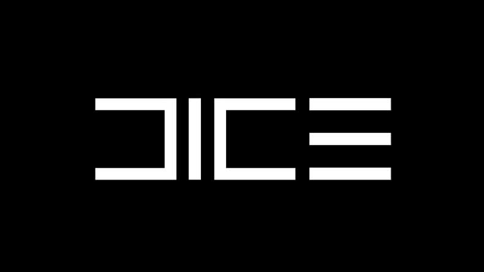
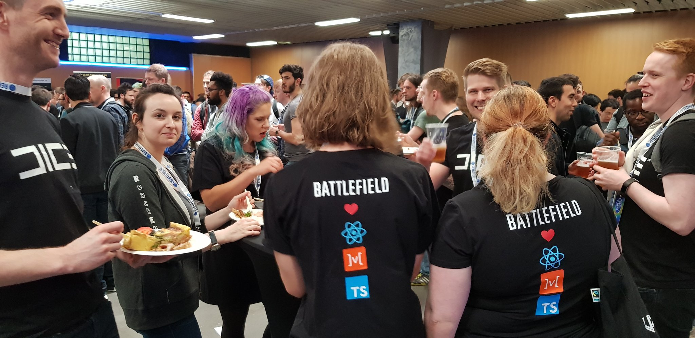
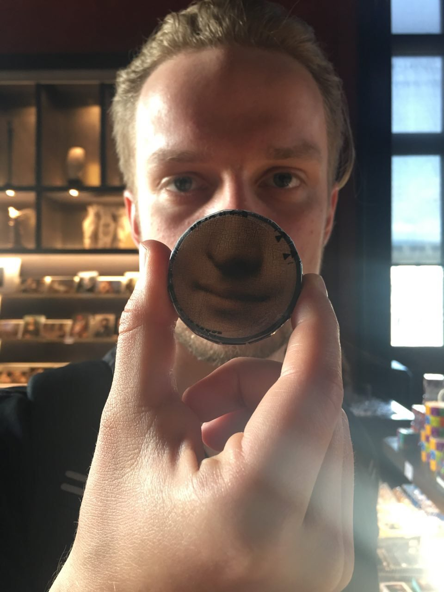

For me 2018 is a year of dramatic changes. New people, new places, new projects. Let me share what happened to me during these months.

## I Moved To Sweden

Right after new year I got hired to [0x.se](http://0x.se) consultancy and moved to Stockholm.

My first client was [starflow.com](http://starflow.com), where I worked on mobile app and web dashboard.

Here is a fun video from the office:

`youtube:https://www.youtube.com/embed/mISuWx7k49k`

I learned a lot about react, react native, flow, static typing, GraphQL while working there.

I worked there the whole winter and bigger part of spring, until...

## I Got Hired To Dice

I was super surprised when I got the opportunity to work there. It's quite unusual, but they use React for game UI.

At the moment I was working on my [Crypto Kitties Clone](https://maksimivanov.com/posts/gradient-coin-tutorial/) series. So I used the [example app](https://github.com/satansdeer/gradient-token)
to demonstrate my coding abilities.

## Visited React Europe 2018

That was super awesome. I got to visit Paris with guys from Dice.

Markus Thurlin gave a lightning talk about the tech behind Battlefield UI.

I visited Louvre, which is mostly about Mona Lisa. Seriously, you can see signs with instructions on how to get to Mona Lisa on every corner. Also a lot of ridiculous merch.

Lip balm, anyone?

Also thanks to my friend Nikita Kabardin - I got to listen to Alessandro Cortini. That was super awesome. You could perceive the music not only with your ears but with the whole body. Some of the tones would resonate with different body parts. Crazy experience.

## Now I'm Working On Battlefield V

Finally the game was revealed, so I can tell what I'm working on.

Here is the game reveal trailer if you haven't seen it yet:

`youtube:https://www.youtube.com/embed/fb1MR85XFOc`

Apparently people didn't like it, ahaha. But according to statistics - this trailer had more engagement than any Battlefield game trailer before.

Anyways, let's see how goes. Currently are working hard to provide the best gaming experience on all levels.
