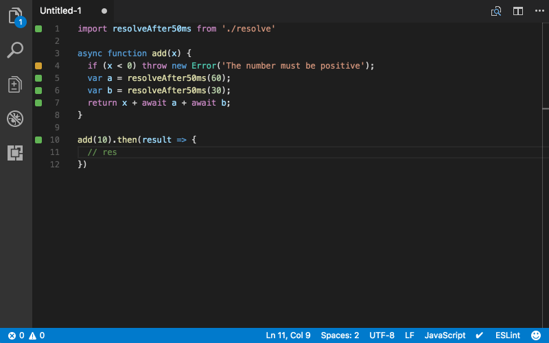
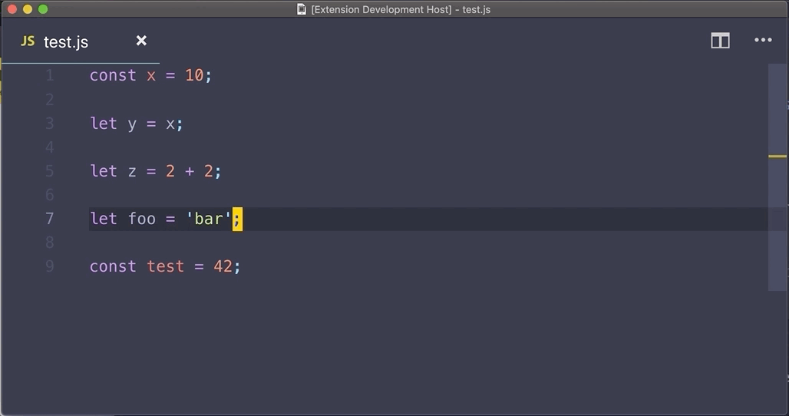

In this tutorial, we'll learn how to create a VSCode extension that will communicate with Node Inspector to collect execution data - basically a Quokka.js clone.

For those who don't know what Quokka.js is - it's a live scratchpad for Javascript/Typescript that allows you to see the results of code execution right in your editor.



The extension that we'll build will be called Wombat.js because wombats are cool and they poop cubes.


I'll be using Typescript because I like to have type annotations and smart code completion when I work with unfamiliar modules/libs.

## Bootstrap New VSCode Extention

We'll start by creating our VSCode extension first.

VSCode provides a Yeoman generator to bootstrap new extensions.

* Make sure you have Yeoman installed globally.

    ```sh
    npm i -g yeoman
    ```
* Run vscode extention generator:

    ```
    yo code .
    ```

    It will ask you a bunch of questions about your project. Answer them and it will create the file structure.

    Here I will assume that you'll also choose Typescript as the preferred language.

* Open the project in VSCode:

    ```
    code <project name>
    ```

    Here you need to put your actual project name instead of `<project name>`.

    > Here I assume that you have a console command installed that allows you to launch VSCode from your terminal.
    > If not - do this: 
    >
    > * Launch VSCode regular way.
    > * Open the Command Palette (`⇧⌘P` on Mac) and type `shell command` to find the _Shell Command: Install 'code' command in PATH command._

* Change command title in `package.json`. It is located in `contributes.commands` block.

    ```json
    "contributes": {
      "commands": [
        {
          "command": "extension.<your extension name>",
          "title": "Run wombat"
        }
      ]
    },
    ```

## Get Data From Node Inspector

Since version 6.3 node provides a built-in inspector which API we are gonna use to get runtime information about our code.


* Open the file `src/extention.ts` and add the following imports:

    ```ts
    import * as path from "path";
    import * as util from "util";
    import * as inspector from "inspector";
    ```

* Make the activation function asynchronous we'll need this to use promises and `async/await` instead of callback API that `inspector` provides by default.

    ```ts
    export async function activate(context: vscode.ExtensionContext) { // ...
    ```

* Launch inspector:

    ```ts
    export async function activate(context: vscode.ExtensionContext) { 
        inspector.open();
    
        // ...
    ```

    This is an equivalent of running `node --inspector somefile.js`.

    Read more [here](https://nodejs.org/api/inspector.html)

* Start new client session. Add these lines after you activate the `inspector`.

    ```ts
    const session = new inspector.Session();
    session.connect();
    ```

* Wrap `session.post` into `promisify`.

    ```ts
    const post = <any>util.promisify(session.post).bind(session);
    ```

    Unfortunately, we'll have to use type `any` here. Usually, I avoid using `any` as much as I can, but here it will use the wrong type because of how `session.post` function is typed.

    This is because `session.post` is overloaded and has different arity for different actions it calls and the fact that by default typescript will pick the last function definition it finds.

    In the case with `post` - it would be:
    ```ts
        post(method: "HeapProfiler.stopSampling", callback?: (err: Error | null, params: HeapProfiler.StopSamplingReturnType) => void): void;
    ```

    As you can see this type allows only `HeapProfiler.stopSampling` as `method`, and we want to use just regular `string` type.

    I didn't want to deal with complex type annotations in this tutorial. Alternatively, you could create your custom `promisify` function that will overcome that limitation.

* Make the `registedCommand` callback - asynchronous.

    To do this search for `vscode.commands.registerCommand` and add `async` before callback definition.

    ```ts
    let disposable = vscode.commands.registerCommand(
    "extension.wombat",
    async () => { // ...
    ```

* Our app will need to get the text from the currently open file, so get the `activeTextEditor` instance.

    ```ts
    const activeEditor = vscode!.window!.activeTextEditor;
    if (!activeEditor) {
      return;
    }
    ```

    We instantly stop the execution if we can't get the editor instance.

    Here is the second time I cut the corners with Typescript here.

    See those `!.` - it tells Typescript that there definitely, 100% certainly, I swear by god is a be a value in the previous field.

    It is called [non-null assertion operator](https://github.com/Microsoft/TypeScript/wiki/What's-new-in-TypeScript#non-null-assertion-operator). It's important that it is not the same as `?.` that is [optional chaining operator](https://tc39.es/proposal-optional-chaining/) (that might be familiar to Ruby, C# and probably other language users) and is not currently available neither in Typescript nor in Javascript.

* Get `document` and `fileName` for later use:

    ```ts
    const document = activeEditor!.document;
    const fileName = path.basename(document.uri.toString())
    ```
* Compile the script from the editor:

    ```ts
    const { scriptId } = await post("Runtime.compileScript", {
      expression: document.getText(),
      sourceURL: fileName,
      persistScript: true
    });
    ```

    Here we use `document.getText()` to obtain the source code. We get `scriptId` that we will need in the next step.

* Run the script:

    ```ts
    await post("Runtime.runScript", {
      scriptId
    });
    ```

* Get all the variables in global namespace:

    ```ts
    const data = await post("Runtime.globalLexicalScopeNames", {
      executionContextId: 1
    });
    ```

    Here I've hardcoded the `executionContextId`. Alternatively, you could get it by subscribing to `Runtime.executionContextCreated` event.

    It will return an array with a list of `var`, `let` or `const` definitions available in the global namespace.

    In the next steps, we'll get their values.

    Of course, this is not how Quokka.js does that, but for this tutorial, it's just enough.

*  Map through the variable names and get their values: 

    ```ts
    data.names.map(async (expression: string) => {
        const {
          result: { value }
        } = await post("Runtime.evaluate", {
          expression,
          contextId: 1
        });
    })
    ```

    We do it by executing variable names as expressions in the same context we run our script.

* Get variable locations. Add this to `map` function.

    ```ts
    const { result } = await post("Debugger.searchInContent", {
      scriptId,
        query: expression
      });
    ```

## Display Info In UI

Now we need to display this information somehow.

I wanted to find out how did Quokka.js do it.

It was surprisingly cumbersome to find the API that allows you to display info on top of the text in VSCode because it wasn't mentioned in the `API` section among the capabilities. So I had to jump directly to the `references` section.

It was mentioned in the API docs as `decorators`, which I find a bit non-intuitive name. I was looking for something like "overlay API" - of course with zero success.

Back to the tutorial:

* Define the `addDecorationWithText` function:

  ```ts
  const addDecorationWithText = (
      contentText: string,
      line: number,
      column: number,
      activeEditor: vscode.TextEditor
  ) => {
      const decorationType = vscode.window.createTextEditorDecorationType({
        after: {
          contentText,
          margin: "20px"
        }
      });
  
      const range = new vscode.Range(
        new vscode.Position(line, column),
        new vscode.Position(line, column)
      );
  
      activeEditor.setDecorations(decorationType, [{ range }]);
  };
  ```

  Due to how those decorations work we need to create a separate `decorationType` for each case because we want to have different `contextText` values.

  Then we define range - in our case, it's just one line so start and end sections of this range are the same.

  And finally, we apply created a decoration to the `activeEditor`.

* Time to use `addDecorationWithText`. Call this function inside of the names `map` we've defined earlier:

    ```ts
    addDecorationWithText(
      `${value}`,
      result[0].lineNumber,
      result[0].lineContent.length,
      activeEditor
    );
    ```

    Add it at the end of that function.

## Launch The Extention

Time to check how our extension works.

* Press `F5` or `Debug -> Start Debugging`.

    It will launch a new VSCode window in debug mode.

* Open some simple Javascript file:

    ```js
    const x = 10;

    let y = x;

    let z = 2 + 2;

    let foo = 'bar';

    const test = 42;
    ```

    This is the file that I've used.

* Run the `wombat` command.

    Open `Command Pallete` (`⇧⌘P` on Mac) and type `wombat`. Then press enter.

    

## Publishing Your Extention

Publishing VSCode extensions is done using `vsce` tool.

There is a [guide](https://code.visualstudio.com/api/working-with-extensions/publishing-extension) in VSCode docs that explains how to do that.

You'll need to obtain your personal `publishedID` and then just run `vsce publish`.

## Final Words

Of course, this extension we've made is very basic and is missing 99.9999999% functionality that is needed to use it for real.

In reality, I believe you would have to also get the AST tree of the script to know exact locations of all the variables you want to track.

Also, you would have to have some state management to store values along with the script execution.

I believe that you also would have to pause the execution in the beginning and then execute the script step by step, recording current state on every iteration.

But all that wasn't the point of this tutorial. I wanted to play around with the available APIs and make a fun project.

The source code is available on [github](https://github.com/satansdeer/wombat). The extension itself is available in [VSCode marketplace](https://marketplace.visualstudio.com/items?itemName=satansdeer.wombat). Ping me [on telegram](https://t.me/satansdeer) if you have any questions.