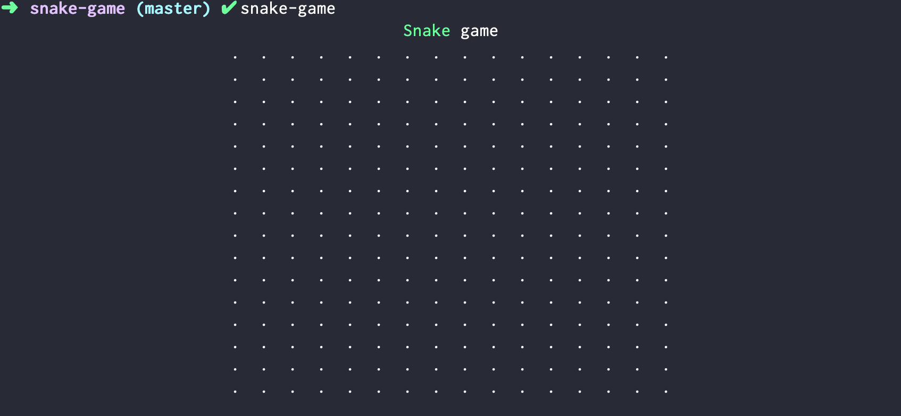
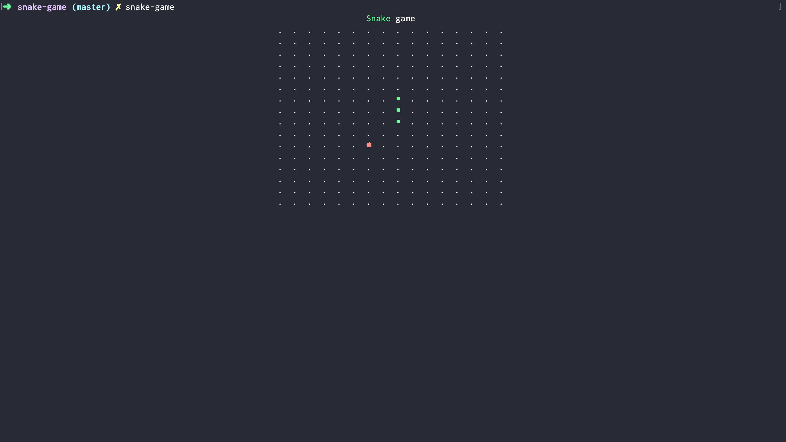
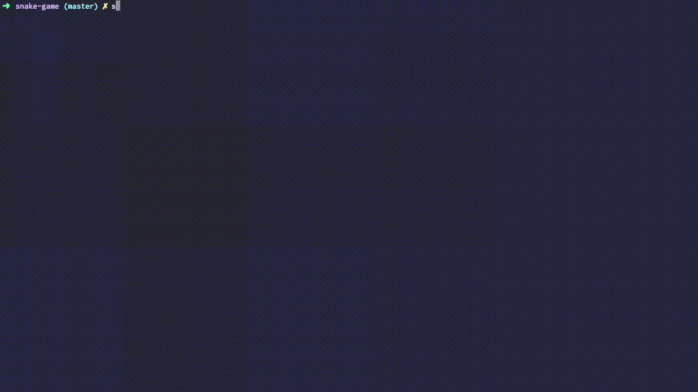
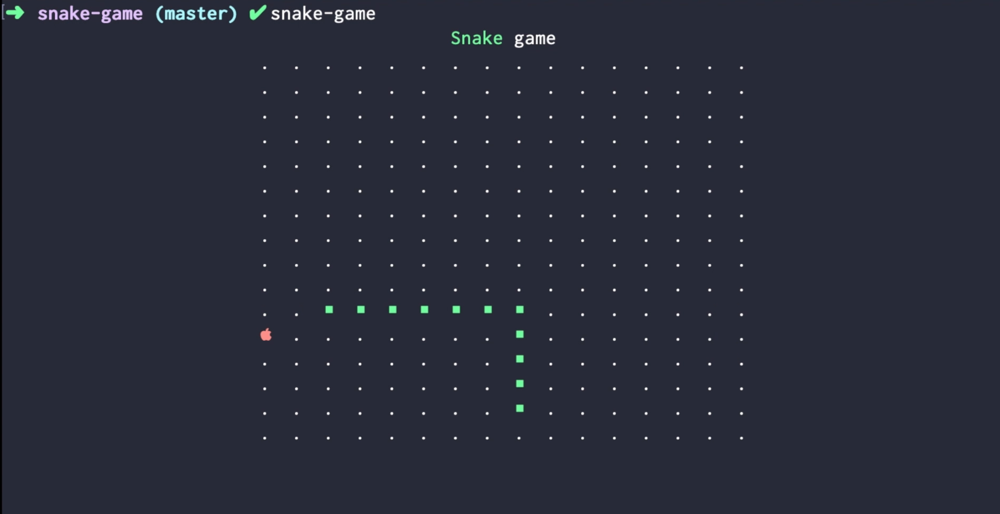

Absolutely CRAZY combo!

In this tutorial we'll learn how to build a **CLI** Snake game using **React** and Javascript.

One of the most powerful features of React is that it supports different renderers. That means you aren't limited with browser and DOM.

Most famous example is ReactNative, but there are other technologies as well. React is actively being used in game dev to build UI (Battlefield V UI, Minecraft launcher, e.t.c)

My mind was blown away though when I saw [Ink](https://github.com/vadimdemedes/ink) - react renderer that outputs to console!

## Create New Ink App

Let's begin by bootstrapping our console application.

- Create a new directory for your project. Open that directory and run `create-ink-app`:

  ```sh
  mkdir snake-game
  cd snake-game
  npx create-ink-app
  ```

- (Optional) I prefer using spaces for indentation - so I open `.editorconfig` and switch `indent_style` to `space`

## Display The Game Field

Ink provides a bunch of components to display. We'll use `Text` and `Box`. `Box` is somewhat similar to `div` in HTML.

- Define the field size:

  ```js
  const FIELD_SIZE = 16
  const FIELD_ROW = [...new Array(FIELD_SIZE).keys()]
  ```

  Then we create an array that we'll use to generate cells of our game field.

- Change the return value of the `App` component to this:

  ```jsx
  <Box flexDirection="column" alignItems="center">
    <Text>
      <Color green>Snake</Color> game
    </Text>
    <Box flexDirection="column">
      {FIELD_ROW.map(y => (
        <Box key={y}>
          {FIELD_ROW.map(x => (
            <Box key={x}> . </Box>
          ))}
        </Box>
      ))}
    </Box>
  </Box>
  ```

  By default `Box` components have `display: flex`. And you can also specify other `flex` attributes as their props.

* You can run the game to see what it renders:

  ```sh
  snake-game
  ```

  You should see this:

  

## Add Food And Snake

Time to add items to our game.

- Define `foodItem` to hold current position of food. Add this to global scope:

  ```js
  let foodItem = {
    x: Math.floor(Math.random() * FIELD_SIZE),
    y: Math.floor(Math.random() * FIELD_SIZE),
  }
  ```

- Define `snakeSegments` as a `useState` hook inside our `App` component to hold our snake position. It will be an array of snakes body segments.

  ```js
  const [snakeSegments, setSnakeSegments] = useState([
    { x: 8, y: 8 },
    { x: 8, y: 7 },
    { x: 8, y: 6 },
  ])
  ```

- Define `getItem` function with following content:

  ```jsx
  const getItem = (x, y, snakeSegments) => {
    if (foodItem.x === x && foodItem.y === y) {
      return <Color red></Color>
    }

    for (const segment of snakeSegments) {
      if (segment.x === x && segment.y === y) {
        return <Color green>■</Color>
      }
    }
  }
  ```

* Now update the return value of our `App` to use `getItem` instead of rendering dots.

  ```jsx
  <Box flexDirection="column" alignItems="center">
    <Text>
      <Color green>Snake</Color> game
    </Text>
    {intersectsWithItself ? (
      <EndScreen size={FIELD_SIZE} />
    ) : (
      <Box flexDirection="column">
        {FIELD_ROW.map(y => (
          <Box key={y}>
            {FIELD_ROW.map(x => (
              <Box key={x}> {getItem(x, y, snakeSegments) || "."} </Box>
            ))}
          </Box>
        ))}
      </Box>
    )}
  </Box>
  ```

  Now if there is food or snake segment in specific point - we render it instead of the dot.

* After you run the game this time - you should see this:

  

## Make Snake Move

Now we'll need to add a game timer that will update the status of our game every 50ms so we can move our snake.

Using timers in React is not that straightforward and there is an article [by Dan Abramov about that](https://overreacted.io/making-setinterval-declarative-with-react-hooks/). We'll use `useInterval` hook iplementation from it.

- Create file `useInterval.js` with following content:

  ```js
  "use strict"
  const { useEffect, useRef } = require("react")

  module.exports = function useInterval(callback, delay) {
    const savedCallback = useRef()

    useEffect(() => {
      savedCallback.current = callback
    }, [callback])

    // Set up the interval.
    useEffect(() => {
      function tick() {
        savedCallback.current()
      }
      if (delay !== null) {
        let id = setInterval(tick, delay)
        return () => clearInterval(id)
      }
    }, [delay])
  }
  ```

* Create `DIRECION` constant to hold directions our snake can go:

  ```
  const DIRECTION = {
    RIGHT: { x: 1, y: 0 },
    LEFT: { x: -1, y: 0 },
    TOP: { x: 0, y: -1 },
    BOTTOM: { x: 0, y: 1 }
  };
  ```

* Create new variable `direction` using `useState` hook inside of our `App` component:

  ```jsx
  const [direction, setDirection] = useState(DIRECTION.LEFT)
  ```

* Create new function, called `newSnakePosition`

  ```js
  function newSnakePosition(segments, direction) {
    const [head] = segments
    return segments.map(segment => ({
      x: limitByField(segment.x + direction.x),
      y: limitByField(segment.y + direction.y),
    }))
  }
  ```

* `newSnakePosition` uses `limitByField` function to handle off-board positions of our snake. Implement this function:

  ```js
  const limitByField = x => {
    if (x >= FIELD_SIZE) {
      return 0
    }
    if (x < 0) {
      return FIELD_SIZE - 1
    }
    return x
  }
  ```

* Now we can use `setInterval` to call `setSnakeSegments` using `newSnakePosition` in our `App` component:

  ```jsx
  useInterval(() => {
    setSnakeSegments(segments => newSnakePosition(segments, direction))
  }, 50)
  ```

* At this point your game should look like this:

  

## Make Snake Move Properly

Now the snake is moving sideways. We need to update the `newSnakePosition` function to fix it.

- Update the contents of `newSnakePosition` function to match the following:

  ```js
  function newSnakePosition(segments, direction) {
    const [head] = segments
    const newHead = {
      x: limitByField(head.x + direction.x),
      y: limitByField(head.y + direction.y),
    }
    return [newHead, ...segments.slice(0, -1)]
  }
  ```

## Implement Eating And Growing

It's time to implement eating and growing. To do this we'll need to detect collision of snakes head with food.

- Implement `collidesWithFood` function:

  ```js
  function collidesWithFood(head, foodItem) {
    return foodItem.x === head.x && foodItem.y === head.y
  }
  ```

  Here we check if `foodItem` and `head` of the snake have same position.

- Now use it inside of the `newSnakePosition` function:

  ```js
  function newSnakePosition(segments, direction) {
    const [head] = segments
    const newHead = {
      x: limitByField(head.x + direction.x),
      y: limitByField(head.y + direction.y),
    }
    if (collidesWithFood(newHead, foodItem)) {
      foodItem = {
        x: Math.floor(Math.random() * FIELD_SIZE),
        y: Math.floor(Math.random() * FIELD_SIZE),
      }
      return [newHead, ...segments]
    } else {
      return [newHead, ...segments.slice(0, -1)]
    }
  }
  ```

  Here we always return `newHead` position and then if we have collided with food - we teleport food to a new position.

## Add End Of Game

At this point the game should be playable. But it's impossible to loose. Let's fix this.

- Add this code before you use `useInterval` inside `App` component:

  ```js
  const [head, ...tail] = snakeSegments
  const intersectsWithItself = tail.some(
    segment => segment.x === head.x && segment.y === head.y
  )
  ```

- We need to stop the game when snake bites itself. Add this ternary operator inside of `useInterval` call.

  ```jsx
  useInterval(
    () => {
      setSnakeSegments(segments => newSnakePosition(segments, direction))
    },
    intersectsWithItself ? null : 50
  )
  ```

  It will disable interval by setting timeout to `null` when snake intersects with itself.

- Now add the end screen. Create new file `EndScreen.js` with following contents:

  ```jsx
  "use strict"

  const React = require("react")
  const { Color, Box } = require("ink")

  module.exports = ({ size }) => (
    <Box
      flexDirection="column"
      height={size}
      width={size}
      alignItems="center"
      justifyContent="center"
    >
      <Color red>You died</Color>
    </Box>
  )
  ```

- Use `importJsx` to import `EndScreen` in `ui.js`:

  ```js
  const EndScreen = importJsx("./EndScreen")
  ```

- Update return value of the `App` component to match this:

  ```jsx
  <Box flexDirection="column" alignItems="center">
    <Text>
      <Color green>Snake</Color> game
    </Text>
    {intersectsWithItself ? (
      <EndScreen size={FIELD_SIZE} />
    ) : (
      <Box flexDirection="column">
        {FIELD_ROW.map(y => (
          <Box key={y}>
            {FIELD_ROW.map(x => (
              <Box key={x}> {getItem(x, y, snakeSegments) || "."} </Box>
            ))}
          </Box>
        ))}
      </Box>
    )}
  </Box>
  ```

  Here you go - CLI React-based Snake game!

  

## Conclusion

Even though Ink is not intended to make games - as you can see even this is totally possible.

I like how easy it is now to create cli apps of any level of complexity, yay!

Here is a [repo with all the code](https://github.com/satansdeer/snake-game). Ping me in [telegram](https://t.me/satansdeer) if you have any questions.
