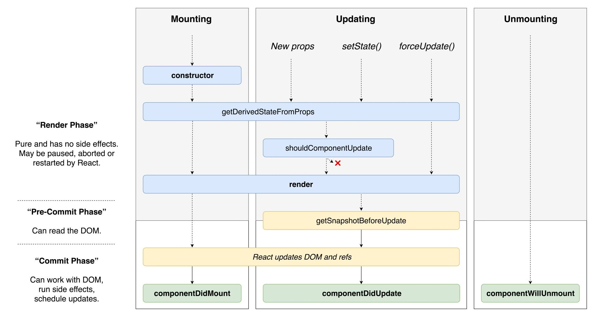

ReactJS provides a bunch of methods that are executed during different stages of components life.

Those are called **lifecycle methods**.

> Lifecycle methods are only available for class based components. For functional components react provides [hooks](https://reactjs.org/docs/hooks-intro.html).

Here is a great diagram by Dan Abramov showing when each of them is being executed.



Let's go through this diagram.

Horizontally it is split into three main stages:

* [Mounting](#mounting)
* [Updating](#updating)
* [Unmounting](#unmounting)

<a name="mounting"></a>
## Mounting

This is first stage each component goes through. During this stage component gets created and then mounted to the DOM.

First method that is being executed during this stage is `constructor`.

`constructor` is being called only once during components life. 

It the place where you set the initial state of your component or `bind` your event listeners.

> If you don’t initialize state and you don’t bind methods, you don’t need to implement a constructor for your React component.

Constructor is the only place where you can and should assign `this.state` directly. In all other methods, you have to use `this.setState()`.

```jsx
constructor(props) {
  super(props);
  // Don't call this.setState() here!
  this.state = { counter: 0 };
  this.handleClick = this.handleClick.bind(this);
}
```

> Avoid introducing any side-effects or subscriptions in the constructor. For those use cases, use `componentDidMount()` instead.

Don't copy `props` to `state`. It’s unnecessary (you can use `this.props.color` directly), and creates bugs (updates to the color `prop` won’t be reflected in the `state`).

`constructor` function is executed only once in component lifetime. So when the `prop` will be updated - it won't update the state.

Next method being executed is `getDerivedStateFromProps`.

This method is used very rarely. The only thing it does - it allows to calculate state based on passed props.

Next goes `render` method. And it's the only method that is required when you declare `class` based component.

In this method you define the layout of your component.

It is being called on every `state` or `props` update.

After `render` finishes its execution, React calls `componentDidMount`.

This method is being called right after `render` when component gets added to the DOM.

Usually it's used to fetch data from backend, or perform other side-effects.

It is a good place to do all the setup you couldn’t have done without the DOM.

* Make calls to external APIs or Javascript frameworks.
* Set timers using using `setTimeout` or `setInterval`.
* Add event listeners.
* Work with the DOM element you've rendered.

<a name="updating"></a>
## Updating

Next big stage is is updating. Methods of this stage get called every time `props` or `state` of the component get changed or `forceUpdate()` gets called.

First method that get's called during this stage is `getDerivedStateFromProps`.

As I already mentioned this method is rarely used.

Then `shouldComponentUpdate` is called, if the update was initiated by changed `props` or `state`.

This method allows you to prevent unnecessary re-renders. So it's used for optimization.

By default it returns `true`. You can return `false` if you want to prevent re-rendering in some cases.

This method is being called before every `render`, except the initial one.

If `shouldComponentUpdate` returned `true` - `render` method is executed.

Next method being called is `getSnapshotBeforeUpdate`. It is being executed right before the changes from Virtual DOM are to be reflected in the DOM.

This method is also used very rarely. Use it if you need to access some data in DOM before it gets overriden.

If you return value from this method it will be passed as third argument to `componentDidUpdate` that is being executed next.

`componentDidUpdate` is the last method that is being executed during update stage.

It is being called after all the changes to DOM are made. It accepts two arguments `prevProps` and `prevState` with values of `props` and `state` of that component before the update cycle has began.

Just like `componentDidMount` it is a good place to put your code that interacts with backend or other Javascript libraries.

If you make API calls make sure to compare current and previous props to avoid unnecessary network requests.

<a name="unmounting"></a>
## Unmounting

Last stage is unmounting and it has only one method - `componentWillUnmount`.

This method is being called right before the component is being removed from the DOM.

It is a good place to perfom the cleanup and remove your event listeners or timers that you might have added in `componentDidMount`.

> You should not call `setState()` in `componentWillUnmount()` because the component will never be re-rendered.

Now if you take a look at the vertical axis you'll see two phases.

First goes **rendering phase**. It is marked by gray background. It is pure and has no side effects. May be paused, aborted or restarted by React.

You shouldn't put any code with side effects inside methods of this phase.

For example you shouldn't make API calls or add event listeners there.

Rendering phase is completed after `render` methods of all the updated components get executed.

Just before **commit phase** when react updates the DOM React calls `getSnapshotBeforeUpdate`, so you can save some data from DOM before it gets overriden.

During this phase React calls one of three methods:

* `componentDidMount` - if it was mounting stage for that component.
* `componenDidUpdate` - if it was one of the supsequent updates.
* `componentWillUnmount` - is called before component is removed from DOM
