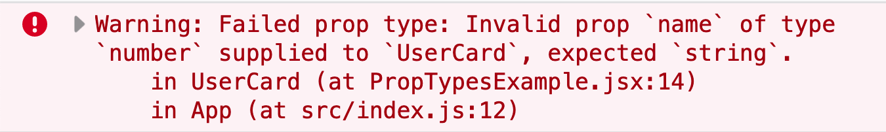
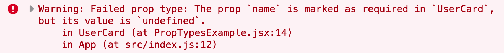
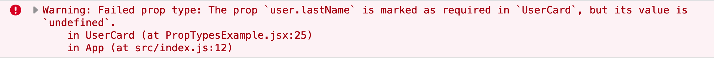

Javascrpt is dynamic language, it doesn't have static typechecking. You can't
syntactically specify that you function works only with strings, or only with numbers.

Same applies to React components. You can pass a `prop` that you component won't
use, or forget to pass the `prop` that it actually uses. Or just pass the `prop` of a wrong type.

This whole set of problems can be solved by **static typing**.

You can use [Flow]() or [Typescript]() to do that, but that would be quite big transition. And if you develop a React components library - your consumers will also have to use same static typing solution to benefit type annotations.

**PropTypes** provide React-specific typechecking for your components. And your consumers will get **PropTypes** warnings even if they don't use **PropTypes** themselves.

> Historically **PropTypes** were part of **React** package. But currently you
> have to install them separately from [prop-types](https://github.com/facebook/prop-types) package.

To start working with **PropTypes** you need to install `prop-types` package:

```bash
yarn add prop-types
```

## Adding PropTypes To A Component

You can specify **PropTypes** on already defined component.

```jsx
import PropTypes from "prop-types";
import React from "react";

const UserCard = ({ name }) => <p>Name: {name}</p>;

UserCard.propTypes = {
  name: PropTypes.string
};
```

This will work with both class and functional components.

```jsx
import PropTypes from "prop-types";
import React from "react";

class UserCard extends React.Component {
  render() {
    return <p>Name: {this.props.name}</p>;
  }
}

UserCard.propTypes = {
  name: PropTypes.string
};
```

If you pass a property with a wrong type you'll get a warning.

```jsx
import React from "react";

const App = () => <UserCard name={42} />;
```

Here we pass `number` instead of expected `string`. So we'll get the following warning:



## Define As Class Level Property

If you define component as a class you can define `propTypes` field for it.

```jsx
import PropTypes from "prop-types";
import React from "react";

class UserCard extends React.Component {
  propTypes = {
    name: PropTypes.string
  };

  render() {
    return <p>Name: {this.props.name}</p>;
  }
}
```

## Using isRequired

By default fields defined in `propTypes` field will be optional. To make them required use `isRequired` suffix.

We can make `name` field required for our component:

```jsx
import PropTypes from "prop-types";
import React from "react";

class UserCard extends React.Component {
  propTypes = {
    name: PropTypes.string.isRequired
  };

  render() {
    return <p>Name: {this.props.name}</p>;
  }
}
```

When you don't specify required field you'll get a warning.



## Using complex values with shape

In previous examples we were using simple values like `string` and `number`. You can specify complex types using `shape`.

```jsx
UserCard.propTypes = {[
  user: PropTypes.shape({
    firstname: PropTypes.string.isRequired,
    lastname: PropTypes.string.isRequired,
    age: PropTypes.number,
  }).isRequired,
};
```

## Specifying default props

Sometimes you want `props` to have some value by default.

For this cases you can use `defaultProps`.

It's syntax is very similar to `propTypes`. For example you can specify it on an already defined component.

```jsx
import PropTypes from "prop-types";
import React from "react";

const UserCard = ({ name }) => <p>Name: {name}</p>;

UserCard.propTypes = {
  name: PropTypes.string.isRequired
};

UserCard.defaultProps = {
  name: "Maksim"
};
```

Here we defined default value for prop `name`.

This prop has `isRequired` suffix, but as it also has default value - if we don't pass any value there it won't show any warning.

## Default Values For Shape

You can also specify default value for fields defined as `shape`.

Keep in mind that in this case it will be merged shallowly.

```jsx
import PropTypes from "prop-types";
import React from "react";

const UserCard = ({ firstName, lastName }) => (
  <>
    <p>FirstName: {firstName}</p>
    <p>LastName: {lastName}</p>
  </>
);

UserCard.propTypes = {
  user: PropTypes.shape({
    firstName: PropTypes.string.isRequired,
    lastName: PropTypes.string.isRequired
  }).isRequired
};

UserCard.defaultProps = {
  user: {
    firstName: "Maksim",
    lastName: "Ivanov"
  }
};
```

Here we specified default value for comples field `user`. Now if we'll pass `prop` user to this item with only one field defined, for example `firstName` - we'll get an error.

```jsx
const App = () => (<UserCard user={{firstName: "Maksim"}}/>)
```

Our prop `user` will override the whole `defaultProps.user` object.

Here is what we'll see in the browser:



## List Of Available Types

Here is a list of types you can use with `PropTypes`:

```jsx
MyComponent.propTypes = {
  // By default all types are optional and only check if types match

  optionalArray: PropTypes.array,
  optionalBool: PropTypes.bool,
  optionalFunc: PropTypes.func,
  optionalNumber: PropTypes.number,
  optionalObject: PropTypes.object,
  optionalString: PropTypes.string,
  optionalSymbol: PropTypes.symbol,

  // This type describes any element that React can render in jsx
  optionalNode: PropTypes.node,

  // React element
  optionalElement: PropTypes.element,

  // You can also check if type matches with specific Class
  optionalMessage: PropTypes.instanceOf(Message),

  // You can check if value belongs to list
  optionalEnum: PropTypes.oneOf(["News", "Photos"]),

  // You can specify multiple types that will match
  optionalUnion: PropTypes.oneOfType([
    PropTypes.string,
    PropTypes.instanceOf(Message)
  ]),

  // Match arrays with specific types of items
  optionalArrayOf: PropTypes.arrayOf(PropTypes.number),

  // Match object with specific types of properties
  // can be used instead of shape when all properties have same type
  optionalObjectOf: PropTypes.objectOf(PropTypes.number),

  // Shape is used when types of fields are known ahead of time
  optionalObjectWithShape: PropTypes.shape({
    color: PropTypes.string,
    fontSize: PropTypes.number
  }),
  
  // You can mark prop as required
  requiredFunc: PropTypes.func.isRequired,

  // You can also use type `any` if prop should accept any type
  requiredAny: PropTypes.any
};
```

Overall **PropTypes** provide a convinient way of runtime typisation and can greatly increase productivity.

You can use static type checking (Flow, Typescript) as an alternative or together with PropTypes.