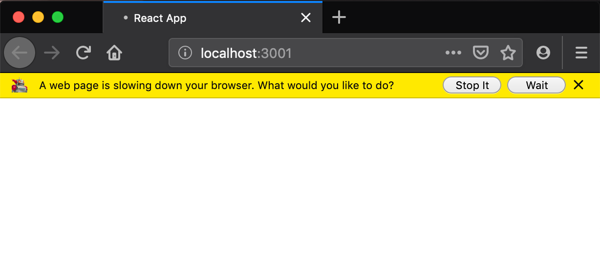
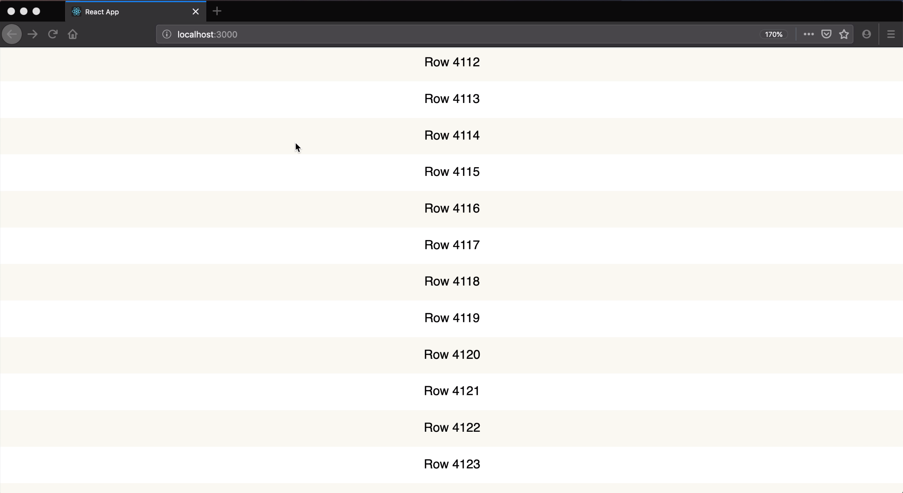
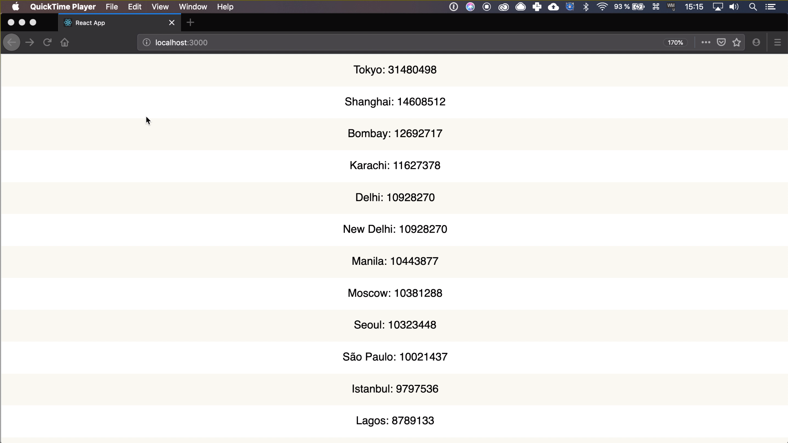

`youtube:https://www.youtube.com/embed/ki6yr9aYsTk`

This is a tutorial on [react-window](https://github.com/bvaughn/react-window), at the end of the article there is a link to a Github repo with code examples.

Rendering lists in React is simple, I would say trivial. You just map through an array of items and output elements.

Like here:

```jsx
<ul>
  {items.map(item => (
    <li key={item.id}>{item.text}</li>
  ))}
</ul>
```

Oh, just don't forget to specify the `key`. Read more about it in [article about lists and keys in React](https://maksimivanov.com/posts/react-lists-and-keys/).

But what if you need to render a couple of thousand items at once?

## The Problem

I'm going to use `create-react-app` bootstrapped application in all my examples in this tutorial.

First, let's try to render 3000000 items as usual and see what happens.

```jsx
export default () => (
  <ul>
    {[...Array(3000000).keys()].map(item => (
      <li key={item}>Row {item}</li>
    ))}
  </ul>
)
```

The browser just hangs and prompts us to stop the script.



## How To Solve It?

We need to optimize rendering. The technique to do is with lists is called **windowing**.

You show only the content that is currently inside of the view boundaries of the user.

In react here is a package [react-window](https://github.com/bvaughn/react-window)

## React Window Simple Example

Here is a simple tutorial on how to use **react-window**.

We'll use the code from the docs as an example.

- Create a new application using `create-react-app`.

```
create-react-app react-window-example
```

- Install dependencies. We'll use `react-window` and also `react-virtualized-auto-sizer` in our example.

```
yarn add react-window react-virtualized-auto-sizer
```

- Go to `App.js`, and import needed packages.

```jsx
import React from "react"
import { FixedSizeList as List } from "react-window"
import AutoSizer from "react-virtualized-auto-sizer"
```

- Add these styles to `index.css`:

      ```css
      html {
        font-family: sans-serif;
        font-size: 12px;
      }

      body {
        margin: 0;
      }

      html,
      body,
      #root {
        height: 100%;
        overflow-x: hidden;
       }

      .List {
        border: 1px solid #d9dddd;
      }

      .ListItemEven,
      .ListItemOdd {
        display: flex;
        align-items: center;
        justify-content: center;
      }

      .ListItemEven {
        background-color: #f8f8f0;
      }

  ````

  Make sure you have it imported in `App.js`:

  ```jsx
  import 'index.css'
  ````

- Define the list component.

  ```jsx
  export default () => (
    <AutoSizer>
      {({ height, width }) => (
        <List
          className="List"
          height={height}
          itemCount={1000}
          itemSize={35}
          width={width}
        >
          {Row}
        </List>
      )}
    </AutoSizer>
  )
  ```

  Here we pass `height` and `width` from `AutoSizer` to our `List` component. We do it so `List` takes all the horizontal and vertical space available.

  We pass `itemSize` - in our case, it's the height of our rows.

* Define the `Row` component:

  ```jsx
  const Row = ({ index, style }) => (
    <div className={index % 2 ? "ListItemOdd" : "ListItemEven"} style={style}>
      Row {index}
    </div>
  )
  ```

  Here we just display current `index`. Also, we apply even or odd class to the element.

* Run your application:

    ```
    yarn start
    ```

    You should see the list with 1000 items in it.

    

It was an example with generated items. Not it's time to learn how to add data to it.

## React Window Example With Data

In this example, we will display a list of cities with their population. We will use the code from the previous example as our base.

- Install `react-window-infinite-loader`

  ```
  yarn add react-window-infinite-loader
  ```

- Import `InfiniteLoader`

  ```jsx
  import InfiniteLoader from "react-window-infinite-loader"
  ```

- Wrap your `List` into `InfinineLoader`

  ```jsx
  export default () => (
    <AutoSizer>
      {({ height, width }) => (
        <InfiniteLoader
          isItemLoaded={isItemLoaded}
          loadMoreItems={loadMoreItems}
          itemCount={1000}
        >
          {({ onItemsRendered, ref }) => (
            <List
              className="List"
              height={height}
              itemCount={1000}
              itemSize={35}
              width={width}
              ref={ref}
              onItemsRendered={onItemsRendered}
            >
              {Row}
            </List>
          )}
        </InfiniteLoader>
      )}
    </AutoSizer>
  )
  ```

  Here I've hardcoded the `itemCount`, you could get this number from the API instead.

  Pass `onItemsRendered` and `ref` to `List` as props. We'll also have to define `isItemLoaded` and `loadMoreItems` functions.

- Define `items` and `requestCache` objects. You don't have to define them inside of the component, because we don't need them to be observable.

  ```jsx
  let items = {}
  let requestCache = {}
  ```

- Define the `isItemLoaded` function.

  ```jsx
  const isItemLoaded = ({ index }) => !!items[index]
  ```

  As you can tell by the name, `InfiniteLoader` uses this function to determine if a particular item was loaded. Here we just check that an item with specified `index` exists in our `items` object.

  We use double negation `!!` to transform object stored in `items` to `boolean`.

- Define the `getUrl` function

  ```jsx
  const getUrl = (rows, start) =>
    `https://public.opendatasoft.com/api/records/1.0/search/?dataset=worldcitiespop&sort=population&fields=population,accentcity&rows=${rows}&start=${start}&facet=country`
  ```

  We'll use this function inside our `loadMoreItems` implementation.

  We get `rows` and `start` as arguments and pass them as `queryParams` in our URL.

- Define the `loadMoreItems`

  ```jsx
  const loadMoreItems = (visibleStartIndex, visibleStopIndex) => {
    const length = visibleStopIndex - visibleStartIndex

    return fetch(getUrl(length, visibleStartIndex))
      .then(response => response.json())
      .then(data => {
        data.records.forEach((city, index) => {
          items[index + visibleStartIndex] = city.fields
        })
      })
      .catch(error => console.error("Error:", error))
  }
  ```

  We need to know the size of the portion of items we want to get. So we calculate the `length` first.

  Then we generate the URL using `getUrl` function and fetch the data.

  After we get the response we iterate through records and save them in our `items` object.

  This function is being called every time you scroll your list, so we'll have to implement some sort of caching.

- Add caching to `loadMoreItems`:

  ```jsx
  const loadMoreItems = (visibleStartIndex, visibleStopIndex) => {
    const key = [visibleStartIndex, visibleStopIndex].join(":") // 0:10
    if (requestCache[key]) {
      return
    }

    const length = visibleStopIndex - visibleStartIndex
    const visibleRange = [...Array(length).keys()].map(
      x => x + visibleStartIndex
    )
    const itemsRetrieved = visibleRange.every(index => !!items[index])

    if (itemsRetrieved) {
      requestCache[key] = key
      return
    }

    // Fetching ...
  }
  ```

  Here we first cache the specific range by converting it to string and storing it in `requestCache` object.

  So for instance, if we try to fetch items from `0` to `10` - we convert this range to string `"0:10"` and store it. Then if we try to fetch the same range again - we'll abort the operation.

  Then we need to check if any items from the range we want to fetch weren't yet fetched before.

  So we generate the whole range of indices. For range `2-8` it will be `2,3,4,5,6,7,8`.

  Next, we map through those numbers and check if all of the indices were already fetched.

  If that is true - we cache the range and abort the operation.

- The last step - update the `Row` component.

  ```jsx
  const Row = ({ index, style }) => {
    const item = items[index]
    return (
      <div className={index % 2 ? "ListItemOdd" : "ListItemEven"} style={style}>
        {item ? `${item.accentcity}: ${item.population}` : "Loading..."}
      </div>
    )
  }
  ```

  If we have the `item` for the `index` - we display it's `accentcity` field, that holds name and `population`. Otherwise, we show `Loading...` label.

- Run the app.

  ```
  yarn start
  ```

  Open the page in the browser - you should see the cities list.

  

## Conclusion

Thank you for following through this tutorial, you can find the source code for it in [this repo](https://github.com/satansdeer/react-window)