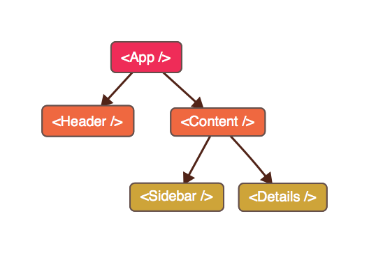

This article is part of react course I'm currently working on. It will be free beginners course published on Udemy. This is an introduction, where I tell what is React, what are React key features and give a quick app example.

## Contents

* [Where Is Used?](#where_is_used)
* [Declarative](#declarative)
* [Component Based](#component_based)
* [Easy To Test](#easy_to_test)

## Where Is used?

ReactJS is an open source library for building user interfaces.

It is used by many big companies: Facebook, Instagram, Netflix, Paypal, Apple and more.

React is primarily used to create applications that can change displayed data without needing to reload the page. Think of Facebook or Instagram feeds that load more posts as you scroll.

But react use cases are not limited by single page applications. It supports server rendering so you can build blazing fast static web-sites. And also it is broadly used for mobile and desktop development and even for AAA game titles like Battlefield.

Let's discuss key advantages that React provides.

## Declarative

React provides a JSX syntax to declaratively describe your applications UI.

Basically you define simple views for each state of your application and React handles data updates and automatically re-renders only the affected parts.

As opposed to __imperative__ programming where you describe __how__ should DOM be changed - in React you describe __what__ should be rendered for given data.

## Component Based

React provides tools to encapsulate your layout inside __components__. This allows you to scale easily and build very complex UIs by composing simple self-sufficient views.

React has unidirectional data flow. That means that you can pass data only __down__ the tree. This makes it much easier to debug and reason about.

## Easy To Test

For the same set of parameters react component will render the same output. It is achieved by avoiding using state in your components. This makes it insanely easy to test your components. You just check that your component returns expected output for given inputs.

If you components handles user interaction - it's still super easy. React uses bound callbacks so you can use test spies to check if the right callback was called after you've clicked the button for instance. And the fact that React components render themselves, makes it possible to just trigger an event and check the resulting HTML for changes

I really liked the comparison that I found in an old [Mateo Clarke blog post](https://www.mateoclarke.com/blog/2015/08/26/what-i-learned-react/)

> In jQuery, you write event handlers which modify the DOM.
In ReactJS, you write event handlers which modify the state. And you write render() to reflect the current state.

This makes what's happening inside your component really transparent.
